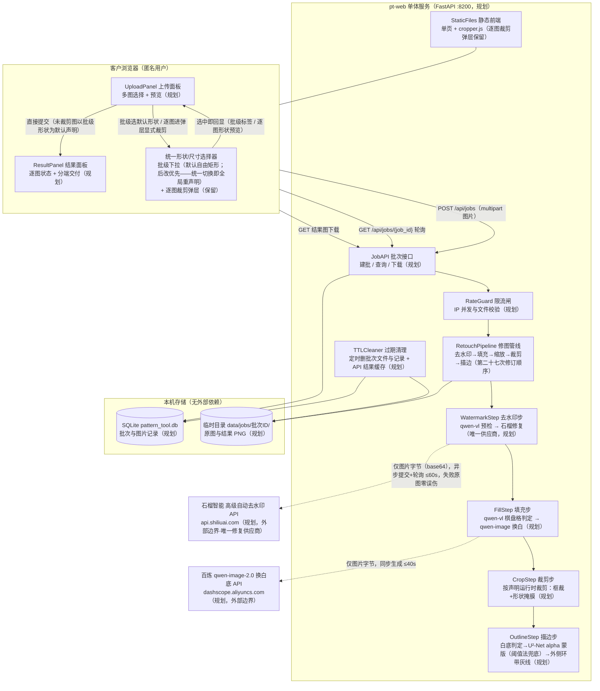
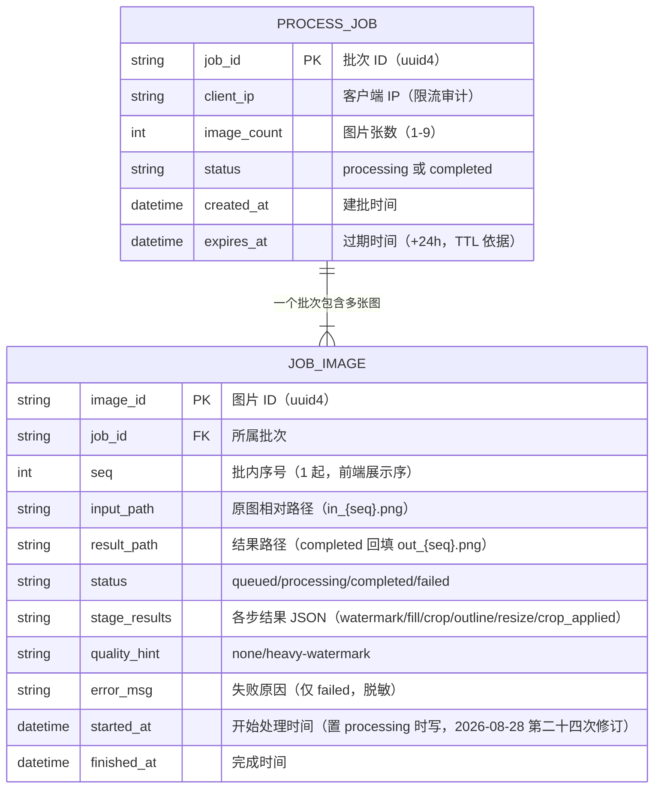
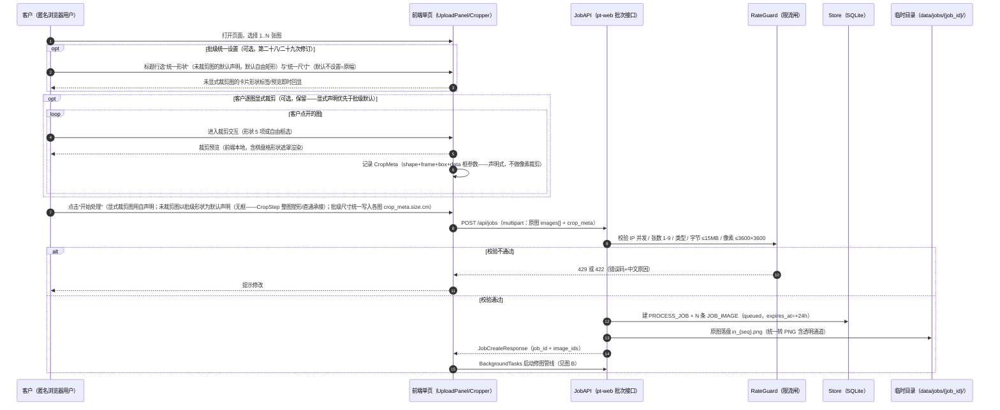
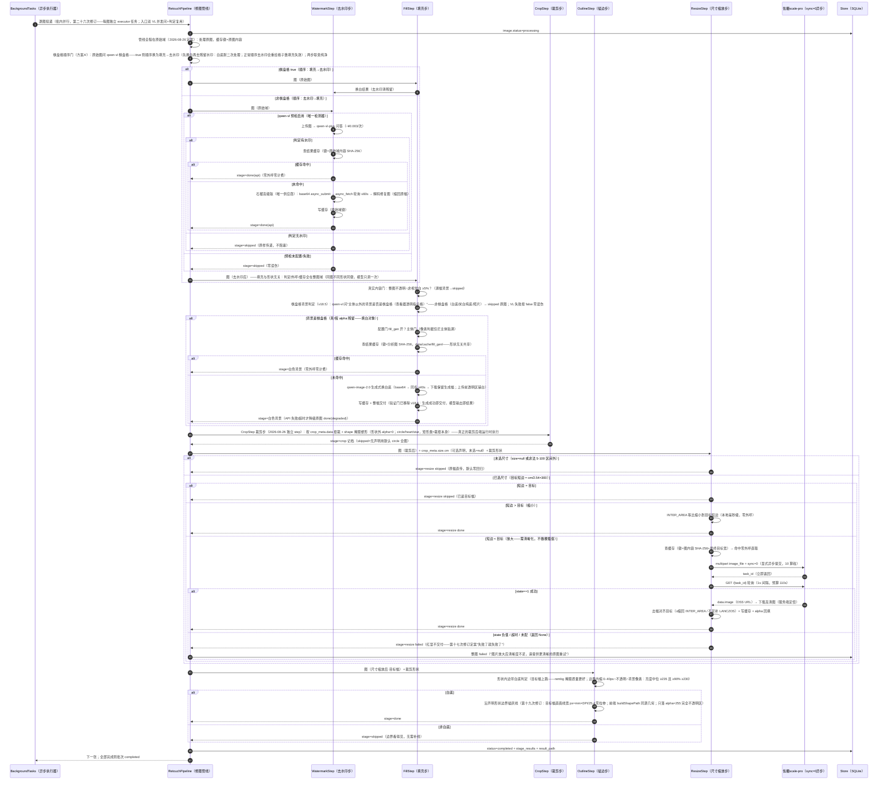
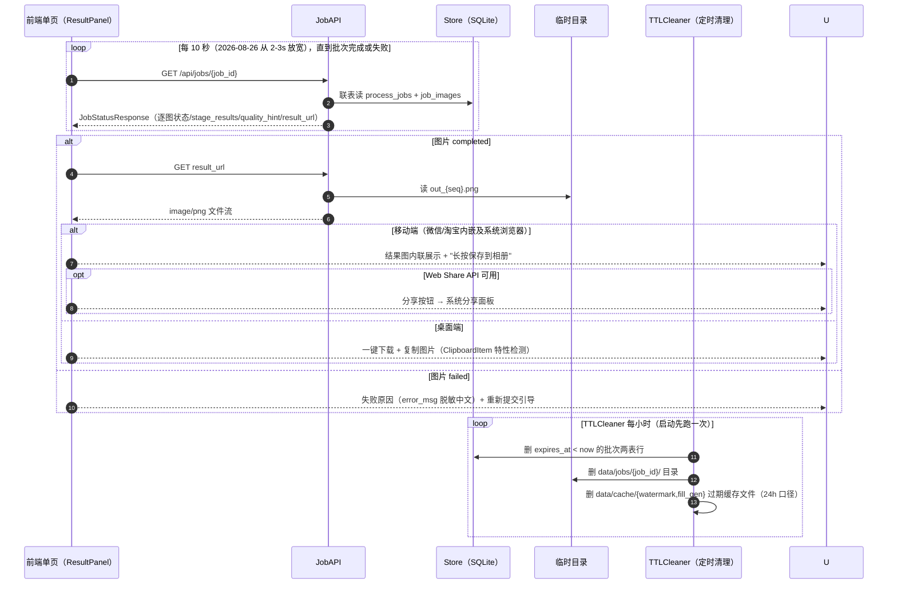

# C 端线上修图工具最小技术方案（pattern-tool）

- 文档类型：模块技术设计（最小可行工具）
- 生成日期：2026-08-24
- 口径真源：《需求文档深度解读报告.html》《技术架构方案.html》《图像处理技术方案.html》（2026-08-24 版）——业务口径与算法阈值来源，不涉及任何既有代码
- 状态标记：本项目为**全新独立项目**（不基于既有系统搭建），所有模块标注 `规划` / `砍掉`，无存量代码
- **修订记录**：
  - 2026-08-29（第三十五次修订）：**无框塑形改「补方后满幅内接」——形状大小批统一**（用户截图实锤 00.40.58/00.43.21：同批统一圆形，正方形图满格、宽图小一圈——"有的顶满了格子边，有的很小"）：①**根因**——无框批级声明的"整图塑形"按 `crop_shape_region_mask` 内接：circle 直径=min(W,H)——**形状大小跟每张图自己的宽高比走**：2694×2244 的宽图圆径只有 2244（左右各挖 225px），与正方形图同批时形状大小各不相同（star 内接覆盖率仅 33%，缺陷放大）。②**修法**——无框塑形分支入口先把画布**居中补方**（短边方向 pad 全透明 alpha=0 到 max(W,H)，copyMakeBorder；内容零损失——不裁只补，图案区像素不动），形状随后在正方形上满幅内接（circle 直径=square 边长=heart/star 包围盒=max 边）——同批不同宽高比的图形状大小**逐像素一致**。③**resize 交互次序记档**——缩放在裁剪前（第二十七次修订）：无尺寸档时原幅补方（如 2694×2244→2694×2694）；有尺寸档时 resize 先到目标短边、crop 再补方到长边等长（如 19cm 档 2244 短边→pad 到长边宽）；描边外环画在补方后幅面上（环外透明含 pad 区，语义不变）。④**不动项**——带框声明路径（data 框等比映射）零变化；rectangle/free 无框仍整图直通（无形状可统一）；square/rectangle-fixed 无框本就居中内接，补方后同为满幅（行为一致性增强）。⑤**前端预览对齐（同日用户二报"还是没撑满"）**——后端补方了但 `attachShapeOnlyPreview` 还在原画布上 clip（circle 直径=min 边）——上传列表预览撒谎、所见即所得破坏；预览改同几何：画布=max 边正方形、原图居中 draw、形状满幅 clip。
  - 2026-08-28（第三十四次修订）：**批级"统一描边"选择器（1–2mm）+ 布局加宽**（用户需求，标签定名"统一描边"）：①**前端**——批级设置行第三个自绘下拉"统一描边"（与统一形状/统一尺寸同款样式，三选择器水平排列）：选项=默认（跟随配置，不写入声明→后端用 `PT_OUTLINE_WIDTH_MM`）+ 1.0–2.0mm 步进 0.1；提交时统一写入各图 `crop_meta.outline_width_mm`，提交后随形状/尺寸同规则复位；`body max-width` 1100→1360（双栏卡片加宽，三选择器不拥挤）。②**后端**——管线从 crop_meta 解析 `outline_width_mm`（合法区间 1.0–2.0，非法/缺失回退配置默认），透传 `OutlineStep.run(..., width_mm)` → `outline_width_pixels(settings, width_mm)` 口径不变（mm×DPI/25.4）；线宽是**打印物理量**，resize 先行保证幅面已到声明尺寸，外环线宽在目标幅上精确落地。③**契约**——crop_meta 新可选键 `outline_width_mm: float`；接口/记档/白名单零变化（crop 字段本就存声明 JSON 原文）。④**样式统一（同日用户实测反馈"第三个选择器和前两个不一样"）**——三选择器固定等宽 118px（不随内容漂移），trigger 用短文案（"自由矩形/不设置/4寸 (9cm)/默认"，长文案只留菜单项），浮层菜单 width:max-content 按最长选项自适应不再裁切，标签间距 18→12。
  - 2026-08-28（第三十三次修订）：**白底判定恢复（修订第三十二次的"无条件执行"）**（用户实测反馈"非白色背景的图也被加上了灰色描边"）：白底判定门的职责从来不是保护内容（外环画法线永不接触内容，三十二次的退役理由搞错了对象），而是**"非白底图的边界本来就看得见，外环是噪音"**——灰底/照片背景不加线（2026-08-24 原口径）。恢复 `shape_inner_band_is_white` 门（置于外环画线之前）；线带净空判定维持退役（它管的"内容压线"在外环画法下结构性不存在）。门管"画不画"、外环管"怎么画"，两者正交。
  - 2026-08-28（第三十二次修订）：**描边改「外边缘描边」——线环外移、内容零接触、线外全透明**（用户下载图实锤定案："描边必须是外边缘描边，充分保留完整有效图片内容，描边外全部 alpha 通道"）：①**根因**——旧内缩画法线带=形状最外 1.2mm 环带**覆盖式写灰**：满幅/近满幅图案（摩羯插画羊角鱼尾顶到画布边）的边缘内容直接被灰线吃掉；浅色图案（冰蓝渐变 luma≥230）连第三十一次净空判定都识别不出是内容——内缩画法语义性无解。②**新画法**——`draw_shape_outline` 重写：画布外扩一个线宽（copyMakeBorder）承接外环，环带=膨胀(形状,线宽)∖形状，整环覆盖写灰 alpha=255；**形状内容区一个像素不动**；环外（含矩形全幅照片原画布边区）全部 alpha=0；沿线剪=线随废料丢弃，成品=完整形状。椭圆核膨胀保证环宽处处=线宽（正确偏移曲线），矩形类四角呈线宽级圆角（方核会让圆环对角处宽 √2 倍——圆角是等宽环的正确形态，缺口 alpha=0）。③**判定门全线退役**——白底判定（shape_inner_band_is_white 两闸）与线带净空判定（第三十一次）随内缩画法退役：存在前提"线会压内容"消失，非白底照片/灰底图现在同样无条件出线（线在透明区上不接触内容）；形状外渗出清洗（第二十一次修订）同退役——形状外区域被 alpha=0 收口，无可见渗出面。函数保留作存档。④**crop 关闭契约保持**——`PT_CROP_ENABLED=false` 时管线不向描边传形状（回退 rectangle 整幅外环），否则外环按形状雕透明违背第二十次修订"不裁框不塑形原图直通"。⑤**3 通道直调兼容**——线在透明区上，裸 3 通道丢线，返回白底合成回显。⑥**交付尺寸变化记档**——成品图幅=原图+2×线宽（如 2835→2869）；管线顺序不变（描边仍最末）。
  - 2026-08-28（第三十一次修订）：**描边加「线带净空」第三道判定——裁切线绝不可被内容压线**（用户真图实锤 21.56.00/21.56.05 定案）：①**现象**——摩羯星座插画（透明贴纸图）内容（羊角/鱼尾）越过灰线直顶画布边，线照画不误——用户沿线剪直接剪掉图案主体，裁切参考线语义失效；②**根因**——白底判定 `_band_background_pixels` 是"**剔除图案后**测背景白度"（2026-08-24 口径，防满幅图案误杀白底）：越线的内容像素被 rembg 归为图案剔出统计，剩余白底通过判定放行画线——对"背景是否白"是对的，对"线能否画在这里"是反的；③**修法**——新增 `line_band_is_clear` 独立判定：线将落笔的环带（几何与画线共用 `_shape_line_band_geometry`，防两处漂移）必须 **不透明占比 ≥95%**（低于则线断，透明贴纸边距常态）且 **视觉白（luma≥230）占比 ≥99.5%**（容忍 JPEG 噪点级杂散，内容级越线必拒）——不净空则整图 skipped（"线所在处必须是可以剪掉的空白"）；④**不动项**——白底判定保留（彩色/灰底照片仍按原语义 skipped）、线宽/灰度/位置口径不变、21 次修订的形状外颜色清洗不变；⑤**顺带记档**——视觉评估另指出 1.2mm/灰度 230 的线在打印浓度低时偏淡（2-3px 屏显观感），系 `.env` 用户自选参数非缺陷，如需更醒目调 `PT_OUTLINE_GRAY_LEVEL=190` / `PT_OUTLINE_WIDTH_MM` 即可。
  - 2026-08-28（第三十次修订）：**统一形状改「后改优先」语义**（用户定案，修订第二十九次修订"显式裁剪优先"的冲突面）：①**现象（用户实测）**——逐图弹层设置过形状的图 `cropMeta` 永久钉死且无清除入口，之后切换批级"统一形状"下拉对这些图完全无效（"统一形状失效，无法改变图片形状"）；②**定案**——切换统一形状 = **全局重声明**：所有 pending 图立即跟随，逐图已设的形状声明与裁剪框一并重置为整图塑形（`cropMeta=null` 回落批级默认 `{shape: batchCropShape, default:true, box:null}`），toast 反馈"已按「X」重置 N 张图的形状声明"；③**语义=最后动作优先**——统一切换→全局覆盖；之后逐图再裁剪→该图自声明优先到下一次统一切换；**裁剪弹层预选当前生效形状**（同修订）：打开弹层时形状下拉预选"该图自声明 || 统一形状"（撤销 2026-08-26"每次打开重置自由矩形"口径——旧口径防的是误用上一张图的弹层选择，预选当前生效值不属此列；用户实测反馈"统一设置形状后逐图裁剪打开还是自由裁剪"）；④**不动项**——提交路由 `cropMeta || 批级默认` 不变（重置后自然走批级）、后端 CropStep/原始域原则零变化、提交后复位规则不变。
  - 2026-08-28（第二十九次修订）：**批级"统一形状"选择器新增（默认自由矩形）——逐图裁剪弹层保留、显式裁剪优先**（用户定案"统一设置一个裁剪选择器，可以统一裁剪，默认是自由矩形"+同日补充"逐个图的形状裁剪同时要保留"）：①**交互模型**——左栏标题行"统一形状"**自绘下拉**（与"统一尺寸"同款样式：trigger+menu 文档流滑出；用户明确不用原生 select——选项样式/定位不可控），选项 rectangle（默认）/circle/square/rectangle-fixed/heart/star，选中即作用于整批未显式裁剪的图，卡片形状标签/形状预览即时回显；**批级设置行位于标题头下方、上传虚线框上方，恒显示不随图片显隐**（第二十九次修订同日定案撤销"先上传再设置"隐藏闸——批级值先选好再上传同样成立），形状+尺寸两下拉**水平排列收窄宽度**（min-width 190→130）、两下拉互斥开合。**裁剪弹层形状模式四角手柄放开**（同日用户定案"圆形、心形、星形的四个角都能够拉伸，不只是右下角"）：`shape-mode` CSS 从仅 `.point-se` 可见改为 `nw/ne/sw/se` 四角锚点全部可见可拖——cropperjs aspectRatio 锁定下拖任意角自动保持形状包围盒比例，形状遮罩 overlay 随 crop 事件重绘（原逻辑不变）。**无框 square/rectangle-fixed 塑形修复**（同日用户实锤"长方形和正方形统一尺寸设置不到图案上去"）：①**根因**——批级无框声明走 CropStep 无框分支，旧逻辑对矩形类一律"整图直通"（square/rectangle-fixed 与 rectangle 同待遇），实测输出 0 像素变化；而 square（正方形）/rectangle-fixed（3:2 长方形）是有形状语义的，与 circle/heart/star 同属"选了形状就该看得见形状"。②**修法**——无框分支的塑形集合从 `(circle, heart, star)` 扩为全部非 rectangle 形状：square=画布居中最大正方形掩膜、rectangle-fixed=居中最大 3:2 掩膜（宽高比与弹层 SHAPE_ASPECT_RATIOS 同源：square 1:1、rectangle-fixed 1.5），形状外 alpha=0（羽化抗锯齿同口径）；rectangle（自由矩形）维持整图直通（默认值零行为变化）。③**掩膜几何收口在 `crop_shape_region_mask`**——矩形类特判从"全图掩膜"改按形状居中内接（square=min 边居中、rectangle-fixed=1.5:1 居中），带框路径与描边路径自动同几何（描边沿形状边界画线也随修复对齐）；前端 attachShapeOnlyPreview 预览口径同步。④**回归**——test_outline_pixels 补无框 square/rectangle-fixed 像素断言（角区 alpha=0、中心不透明）。②**优先级语义**——逐图裁剪弹层（cropperjs）保留：显式裁剪的图仍用自声明的 shape+框；**未显式裁剪的图提交时以批级形状作默认声明**（`{shape: batchCropShape, default: true, box: null}`——原硬编码 rectangle 默认撤销）。③**无框语义承接**——批级声明不带 data 框，CropStep 既有"无框合法 shape"分支承接：circle/heart/star 整图塑形（形状外 alpha=0）、矩形类（square/rectangle-fixed 无框同）整图直通——**后端零改动**。前端回显同口径：矩形类批级形状不显标签不画预览（直通不撒谎），circle/heart/star 画形状预览（复用 attachCroppedPreview 整图框合成）。④**提交复位**——批级形状与尺寸同规则：提交后复位回默认（rectangle/不设置），只作用于本批。⑤**后端契约不变**——crop_meta 逐图 JSON（shape 必有、data 可选）；`GET /api/meta` crop_shapes 保留（形状枚举真源）。README 口径同步。
  - 2026-08-28（第二十八次修订）：**前端逐图尺寸下拉撤销——打印尺寸仅保留"统一尺寸"批级入口**（用户定案"不需要给每个图设置尺寸"）：①**改动面纯前端**——`web/app.js` renderUploadList 删逐图 size-select（档位下拉+自定义 prompt 整块）与 `item.sizeCm` 字段，改批级变量 `batchSizeCm`：选中即记值，**提交时统一写入全部图 crop_meta.size.cm**；`web/index.html` 删 `.size-row`/`.size-select` 样式。②**语义修正**——旧批量实现选中时逐一写当时列表内的 item，选完再补传的图静默无尺寸（"全部: xx"文案与事实不符）；批级变量模型下补传图自动同批生效，trigger 文案即单一事实源。③**取消自定义输入回退**——批级模型下"回退不设置"同时清 `batchSizeCm`（旧实现 UI 回退但各图隐藏值残留，显示撒谎）。④**后端零改动**——接口契约不变（仍是逐图 crop_meta.size.cm 可选声明，ResizeStep 逐图读取），本修订纯前端入口收敛；"先上传再设置统一尺寸"引导提示保留（2026-08-28 定案）。README 快速开始链路口径同步。
  - 2026-08-28（第二十七次修订）：**管线顺序再调换：去水印→填充→缩放(变清晰)→裁剪→描边——缩放提前，超分缓存回原始域**（用户定案，成本优化）：①**动机**——第十九次修订顺序下裁剪在缩放之前，送佐糖的图是**裁剪后**的图，超分缓存键（图内容 SHA-256+目标宽）里的"图内容"随形状/框变化：同图不同形状/不同框二次提交必 miss——同图 4 次提交 3 次外呼的超分版（¥0.41/次全重复计费）；去水印/填充的缓存键在原始域无此问题，唯独超分裸奔。②**修法（最小改动）**——pipeline.py 五步顺序 crop↔resize 交换：缩放吃"去水印+填充后"的原始域图（裁剪前，键稳定），裁剪吃放大图（框坐标按 frame→当前幅等比映射，crop.py 原有映射逻辑天然兼容）；描边仍最末（目标幅直画线宽，第十九次修订口径不变——顺序里它仍在缩放之后）。③**缓存收益**——超分键自动回原始域（键逻辑零改动，是送进去的图变了）：同图同尺寸档跨形状/跨框命中，二次提交零外呼；缓存命中路径 `_reattach_alpha` 贴回的 alpha 是原始域 alpha，在新顺序下语义不变（裁剪随后在高幅重新塑形）。④**形状掩膜分工**——resize 的 `shape_value` 掩膜重画参数保留但管线不再传（缩放时还不知道裁剪结果）；形状塑形全部由裁剪步在高幅完成（`crop_shape_region_mask` 解析几何任意分辨率无损，羽化抗锯齿随 crop 走）。⑤**边界语义记档**——用户选大尺寸档+小裁剪框时，裁后短边可小于档位目标（"目标档约束放大基准图短边，裁剪允许缩小"）：与旧顺序的边界同源（旧序先裁后放，非正方形框裁完放大短边也未必=目标），非本次引入；打印按实际交付尺寸。⑥**收益量化**——多形状/多框场景每图省 1 次佐糖外呼（¥0.41/次）；描边/判定/去水印/填充行为零变化（顺序只动 crop↔resize 两步）。
  - 2026-08-28（第二十六次修订）：**管线并行化 A+B：批内图并行 + 单图内双 VL 外呼重叠（供应商批量 API 核实为负结论）**（用户定案，撤销 2026-08-26 21:58「批内串行」决定）：①**动机（日志实测）**——单图 28-44s 中 85% 是外呼等待（VL 预检 0.8-20.6s / 石榴修复轮询 9.8-16.3s / 佐糖超分轮询 10.4-10.9s），本地五步合计仅 ~2s；串行下 9 图批各图外呼等待逐个排队，墙钟 5-8 分钟。②**当年撤回并行的真根因（本次一并修复，非并行本身之罪）**——完成回写 `update_image(status="completed")` 无终态守卫：重启恢复 `fail_interrupted_images` 置 failed 后被管线线程无条件 completed 盖回（test_startup_recovery 偶发 'processing'!='failed' 即此）；批次级兜底 except 把快照内全部 queued/processing 兄弟图误标 failed；三个结果缓存 cv2.imwrite 直写非原子，并发读到半张 PNG 按未命中处理会多花一次外呼。③**新架构（A 批内并行）**——`submit_job` 逐图投递 core 单例池（每图一个 executor 任务，撤 `_run_job` 串行循环）：每图任务自捕获失败（兜底不再误杀兄弟图），终态后各调 `complete_job_if_done`（COUNT + UPDATE WHERE status='processing' + rowcount，幂等天然防漏置/双完成）；**排队超时改投递时刻 deadline 检查**（任务启动时 `now - enqueued > image_queue_timeout_seconds` → failed 话术错峰）——旧「信号量 acquire(timeout) 阻塞等位」占住 worker 线程干等，删除 `_processing_semaphore`（并发上限由 executor max_workers=`PT_MAX_CONCURRENT_PROCESSING`（0=自动 2×CPU）直接承担，语义不变）；**完成回写改条件更新** `try_complete_image`：`UPDATE job_images SET status='completed',... WHERE image_id=? AND status='processing'` 判 rowcount——终态单向（queued→processing→completed/failed）在 DB 层闭环，与 recovery/TTL 写并发安全（race 输掉时 out 文件成孤儿由 TTL 24h 清，记档容忍）。④**新架构（B 单图内外呼重叠）**——链头两个 VL 问答（棋盘格判定 + 水印预检）都以原始图为输入且互不依赖：`_run_steps` 入口 `_ask_entry_verdicts` 用随图建的 2-worker 短命池并发两问（问域统一为白底合成分析图=FillStep 标定 4/4 的域），失败语义逐条保留（棋盘格失败按 False 走正常顺序、预检失败按 None 走 skipped 零误伤）；**判定复用消灭重复外呼**——旧路径同图固定问 2-3 次 VL（顺序门棋盘格一次 + FillStep 内部同问题一次 + 水印预检一次）；新路径：fill-first（棋盘格 true）下入口棋盘格判定直传 FillStep（同图域精确）、入口预检结果**丢弃**（换白生成重绘背景，原图域答案对生成图不成立，WatermarkStep 照旧自问）；正常顺序（非棋盘格）下入口预检直传 WatermarkStep（同图域精确）、入口棋盘格判定直传 FillStep（水印修复只重绘水印区不引入棋盘格，近似成立）。⑤**供应商批量 API 核实（负结论）**——石榴 `auto_inpaint_advanced/v1` 请求体仅 `image_base64/image_url` 单图字段（官方文档实读），佐糖 scale-pro 同为单图任务制；批量意图由 A 的客户端并发 + B 的判定去重承担，**后人勿再调研批量端点**。⑥**五步本体仍严格串行（架构约束不变）**——裁剪必须在填充后（原始域原则：裁剪提前破坏缓存键稳定，回归「同图 4 次提交 3 次外呼」翻车现场）；描边必须在缩放后（第十九次修订目标幅直画）；石榴/佐糖轮询间隔维持（wait_time 是下界估计最差低估 2.6 倍、佐糖 1s 化省 0.5s/图但请求数翻倍，侦察量化后均不值）。⑦**配套加固**——三个结果缓存 `put` 改内存编码+唯一临时文件+`os.replace` 原子落位（并发读者永不见半张 PNG）；连接池核实：9 图并发峰值 ≤9 在飞协程 < httpx limits=32，安全；两家供应商无 429 重试处理（现状 failed 语义兜底，并发放大后观察）。⑧**预期**——3 图批 ~100s→~30-45s（最慢一张+波次重叠）；9 图批 5-8min→~1.5-2min（受 2×CPU worker 数截流，可 `PT_MAX_CONCURRENT_PROCESSING=9` 全并行）；非棋盘格图省 1-2 次 VL 外呼/张。
  - 2026-08-28（第二十五次修订）：**描边线宽羽化补偿（resize 形状 alpha 过渡带吃线）**（用户批 d6ac1f0e 正交实测定案）：①**现象**——同批同配置（1.2mm）两张图物理线宽不一致：心形 9cm 图 15px=1.27mm、圆形 24cm 图 12px=1.01mm（理论 14.2px=1.20mm）；②**排除**——灰度 230 无辜（对照实验：同图同幅只变灰度 230↔190，线带等宽 15px，"灰度低对比虚胖"诊断证伪不成立）；③**根因**——放大路径 resize 末尾形状 alpha 重画带 sigma 0.8 高斯羽化（消光栅台阶锯齿，第二十次修订引入），形状边界内 ~2px 是 alpha<255 半透明过渡带；而 `draw_shape_outline` 只在 alpha==255 硬区落笔（防半透明混色断线）——线带最外 1-2px 落进羽化区被排除，且**幅面越大羽化占比越高吃得越多**（低幅 CropStep 光栅掩膜边界过渡更窄，几乎不吃）——同配置不同出幅线宽漂移的真根因；④**修法**——线带起画位置内缩「线宽+2px 羽化补偿」（`SHAPE_EDGE_FEATHER_COMPENSATION_PX = 2`）：线带整体内移 2px 但厚度按线宽参数画足，起画点全落 alpha==255 硬区——物理线宽回到参数值（±1px 光栅舍入）；⑤**记档屏幕粗细差非 bug**——前端缩略图 `aspect-ratio:1` 等宽显示：9cm 图 1063px 缩 4 倍（线→~4px 屏显偏粗）、24cm 图 2835px 缩 11 倍（~1.4px 偏细）——同一物理毫米在不同分辨率缩略图里的显示假象，打印物理宽度一致。
  - 2026-08-28（第二十四次修订）：**单图计时口径改「仅执行中计时」+ 前端计时器架构重写**（用户截图实锤 04.14.43 定案）：①**口径修订（撤销 2026-08-27"墙钟含排队"口径）**——旧计时从提交时刻起算且排队中也计时，用户定案"应该只有执行中的图才计时"：排队中不计时；执行中实时计时（锚点=服务端 `started_at`，管线置 processing 时刻写入，排队等待天然排除）；终态定格 `finished_at - started_at` 服务端真值。②**前端计时器架构缺陷修复**——旧 `createElapsedTimer` 每卡各建 500ms interval 但共用一个全局 timerId，每建新卡即清掉前卡的 interval：批内只有"最后渲染那张卡"实时走、其余卡冻结只能靠 10s 轮询重建时跳一格（截图图3 实时 28s、图1/2 冻在 20s 实锤）；且终态卡按 `Date.now()-提交时刻` 每轮重算会回涨。新架构：**单个全局 ticker** 每 500ms 遍历刷新全部 `.elapsed-timer` span（`data-start-ms` 锚定，无互相清除），终态一次性定格不再参与刷新。③**后端补真值**——`job_images` 加 `started_at TEXT` 列（管线置 processing 时写 UTC ISO；`finished_at` 已有）；ImageStatusDTO 下发 `started_at/finished_at`，JobStatusResponse 加 `server_time`（前端钟差校正：`start_ms = parse(started_at) + (Date.now()-parse(server_time))`）；`_init_schema` 对旧库 `ALTER TABLE ADD COLUMN` 幂等补列（生产不清 data/，旧表缺列防炸）。
  - 2026-08-28（第二十三次修订）：**API 四接口 async def → 同步 def（事件循环零阻塞化）**（代码审计实锤）：①**根因**——四个接口此前均为 `async def`，函数体直接跑在 uvicorn 事件循环上，体内全部同步调用独占循环：建批路径的逐图 `decode_to_ndarray`+`encode_png`+`write_bytes`（3600×3600 单张实测 0.06–0.3s，纹理图 PNG 出幅 30–52MB）、≤15MB SHA-256 查重指纹、2N+1 次 SQLite 写事务（且与管线线程争 `JobStore._write_lock`）——9 张批空载连续卡循环 1–4s、管线满载 CPU 争用时上探十秒级，期间**所有客户端**的轮询/上传/下载全部停摆；轮询接口（GET /api/jobs/{id}）两条 SELECT 亦在循环上（单次 0.1–2ms，本身轻，是建批阻塞的直接受害者）。②**修法**——四接口改同步 `def`：FastAPI 对非协程端点自动 `run_in_threadpool` 整个函数体（fastapi/routing.py，实装 0.141.1 证实），一次性把上述全部阻塞调用移入 Starlette anyio to_thread 线程池（默认 40 token，与同步依赖/FileResponse stat 共用），事件循环只留请求解析与响应编排；配套 `await upload_file.read()` → `upload_file.file.read()`（同一个 SpooledTemporaryFile，字节/滚存状态完全一致，滚存读本来就该在线程池）。③**安全性三路验证**——SQLite 连接按 threading.local 每线程一条对 anyio 工作线程同样成立（check_same_thread 默认 True 连接绝不跨线程；空闲 worker 10s 被修剪、连接随线程消亡由引用计数关闭，无泄漏）；写事务仍被 `_write_lock` 进程序列化（接口/管线/TTL 三方写全序不变）；读路径无锁 + WAL 读写互不阻塞。④**行为差异记档**——限流闸 count_active_jobs_by_ip 与 create_job 之间从同线程顺序执行变为可能与其他请求线程交错，并发上传时同 IP 可能短暂超 3 批上限一两批（原 async 形态下两调用间已有 await 让出点，该交错今天已存在，本次只是扩大窗口非新引入）；事件循环线程的 SQLite 连接退化为仅剩 lifespan 预热意义。⑤**边界口径**——multipart 表单解析本身仍发生在依赖求解阶段（接口体之前），本次改动收口的是「接口体内的阻塞 IO」，不宣称「请求全程不占循环」。与 2026-08-27 core/http.py 全进程唯一事件循环线程（修订记录存档）的关系：那是「管线同步线程调协程」方向，本修订是「接口协程改线程」方向，两线程域互不影响。顺带记档两处相邻循环域阻塞点（本次不动，后续单独定夺）：lifespan 启动段 `run_startup_recovery()`（ttl.py:65 内联执行，生产不清 data/ 时重启可把「端口不响应」拉到秒级以上）；关停段 `close_http_client` 的 `future.result()` 无超时（后台循环线程被慢请求占住时可钉住循环数十秒，仅影响关停期）。
  - 2026-08-28（第二十二次修订）：**删除 auto-hd 自动变清晰（尺寸缩放严格跟随用户声明）**（用户定案）：旧路径"未选尺寸且源短边 <2019px 自动按 8寸档提升"与前端"不设置（原图大小）"承诺矛盾（用户实测没选尺寸仍被放大困惑实锤），且与佐糖缩放启用逻辑不一致——缩放外呼只应由用户显式选尺寸触发。删除后：不设置 = 严格原幅直通 resize=skipped；小图原幅交付（糊图责任回归客户选择）。pipeline.py 删 auto-hd 分支与 AUTO_HD_* 常量。2026-08-26 16:22 的"小图自动变清晰"定案就此撤销。**描边前形状外颜色清洗（图案渗出描边线修复）**（用户真图实锤：截图 02.40.27 图案内容越过描边线渗到线外，线没包住图案）：①**根因**——第十九次修订后管线存在两个边界各走各路：alpha 边界由 resize 末尾解析式形状掩膜重画（数学精确）；图案**颜色边缘**经佐糖服务端定倍 + LANCZOS 尾程重采样，边缘像素外渗/振铃越过解析边界数 px（实测 1460-1660 行段隔离带像素值 134-191 深色图案内容，14/14 采样行渗漏）；描边线沿解析掩膜内侧画（位置正确）→ 线被渗出的颜色"绕过"。②**修法**——draw_shape_outline 画线前先做形状外颜色清洗：颜色像素[~解析形状掩膜]=纯白，渗出部分清掉露出白底，恢复线-边界隔离带；与 alpha 重画同构（alpha 已解析、颜色对齐解析）。③矩形类掩膜=整图，清洗零操作零开销；清洗只动形状外已渗出的伪影像素（本就半透明/振铃），形状内图案无损。**删除 PT_STEPS_ENABLED 步骤总闸（与各步开关冗余）**（用户定案）：该开关原定位单步调试，但生产语义已被各步独立开关完整覆盖（watermark→PT_WM_API_ENABLED+PT_WM_PRECHECK_ENABLED、fill→PT_FILL_GEN_ENABLED、resize→PT_SCALE_ENABLED、outline→白底判定自然 skipped、crop 本来就恒执行），两套开关并存徒增心智负担与排查层级；且它有前科——第十四次修订刚修过"只改记档不拦截执行"的初始 bug。删除后管线恒跑五步，每步跑不跑由自身业务条件决定；单步调试场景用各步开关单开等价达成。同修订补 crop 档：`PT_CROP_ENABLED`（默认 true）——false 时声明式裁剪整体跳过（不裁框不塑形原图直通，skipped 记档），五步至此各配独立开关（watermark 双门/fill/outline 白底自然 skipped/crop/resize）。config.py 删 steps_enabled 字段、pipeline.py 删 enabled_steps 逻辑、test_steps_enabled.py 转为各步开关语义或删、.env 两文件同步。**管线顺序调换：描边移到尺寸缩放之后（高幅直画）**（用户归因实锤——心形描边锯齿+线宽漂移同根因）：①**根因**——描边在低幅画线（线宽px=mm×DPI/25.4，物理恒定假设依赖等比缩放）→ 佐糖服务端定倍 ×5.7 + 尾程 LANCZOS ×1.53 非常规倍率链拉伸：2px 线变 9.7px@3140=0.82mm（配置 0.2mm 漂 4 倍）+ LANCZOS 振铃锯齿（采样实锤：灰线值 220↔244 交替波动；alpha 掩膜因解析式重画反而平滑）；②**新顺序**——去水印→填充→裁剪→**尺寸缩放→描边**（描边成为管线最末步）：在目标幅直画线宽 px=mm×DPI/25.4（零拉伸零振铃，物理毫米精确），白底判定与 rembg 分割也在高幅跑（分割质量更好，代价是 rembg 在 3140 幅耗时增加 ~1-2s）；③**描边线宽像素计算不变**（outline_width_pixels 口径本来就是 300DPI 幅的 mm→px），变化的是执行幅面从源幅变目标幅；④矩形类/形状类描边逻辑不变；⑤形状掩膜重画仍在 resize 内（描边吃掩膜边界在 resize 后依然成立）。**超分主力回佐糖 scale-pro，石榴超分全线退役**（用户定案："石榴清晰化历版无一符合要求，与理想状态差异较大"）：①**客户端恢复**——`picwish_scale.py` 从 git 历史恢复（第十一次修订曾删）并按官方文档异步形态重写：`POST /api/tasks/visual/scale-pro` multipart `image_file + sync=0`（显式异步，并发大成功率优）→ `GET /{task_id}` 轮询（1s 间隔，官方预算 180s，配置 `PT_PICWISH_TIMEOUT_SECONDS=110`）→ `state==1` 下载 `data.image`（OSS URL 1h 有效）；负值失败、0/2/4 进行中（2=Preparing 实测记档）；②**配置独立**——新键 `PT_PICWISH_API_KEY`（佐糖 key 已充值复活；与石榴键、去水印键全部独立）；③**出幅对齐**——服务端决定倍率，出幅 ≥ 目标 INTER_AREA 缩回（无损）、不足 LANCZOS 补尾程（服务端定倍协议的结构性尾程）；④**失败语义沿袭第十七次修订**——failed 不交付；⑤**石榴超分下线**——`shiliu_scale.py` 删除（两段链/高级版打底等历版形态全部退役，回退从 git 历史），石榴在系统的存留职责只剩去水印；⑥缓存沿袭（键=图内容+目标宽）；⑦**尾程友好提示**（用户同日定案：维持 3425 目标接受尾程，但客户可见）——佐糖出幅 < 目标（尾程 LANCZOS 放大 >1.15x）时 quality_hint=suggest-larger-source，前端黄标『建议提供更大尺寸的原图（当前图片放大后清晰度有限）』；出幅 ≥ 目标零尾程不提示。实测锚点：360px 源→佐糖 2048→12寸档尾程 1.67x 触发提示；大源（≥ 目标/5.7）直出零尾程。hint 值域：none / heavy-watermark / suggest-larger-source。
  - 2026-08-28（第十七次修订）：**超分改"高级版打底+大图续跳"单路径，失败语义改 failed 不交付**（用户定案）：①**调用形态**——放大路径改为：`super_resolution_advanced/v1` ×4 生成式重建打底（1 积分，异步 15-25s，边缘强度 10.6 细节饱满）→ `large_resolution/v1` 低倍率两跳续到目标（1440→2055→3425 形态，每跳 1.43x/1.67x，4 积分）；实测 826 图→3425px 锐度 51.9（纯大图三跳 31.3、续跳直出 21.9）；纯大图链从源直放会把边缘强度从 10.6 钝化到 4.5——"大图变高清变糊"的用户目检得到量化印证，大图链只作续跳不作主力；②**失败语义**（用户定案"失败了就失败了"）——任一环失败记 `resize=failed` 前端红显不交付：删除纯大图链回退、删除 Lanczos 插值兜底、`done(interpolated)` 语义退役（插值图 9.5 倍数学拉伸锐度 ~3 根本不可用，交付废图不是保交付；"请提供更清晰的原图"的失败提示倒逼上游图源质量）；③**缓存**：键不变（图内容 SHA-256+目标宽），整链结果一个键；④**成本**：12 寸档 5 积分 ≈ ¥0.078/张（原三跳 6 积分），耗时 ~22s（原 8s，高级版异步轮询是大头）。
  - 2026-08-27（第十六次修订）：**自定义尺寸上限 100→33cm（对齐真实打印设备）**：用户核设备为佳能 iX6880（A3+ 照片喷墨），官方规格最大打印宽度 322.2mm（有边距）/329mm（无边距 A3+ 13″），走纸方向长边 48.3cm——系统短边口径上限定 33cm 正压无边距能力。原 100cm 为拍脑袋值：超设备物理能力（打不出）、超分必失败（100cm@300DPI=11811px 超石榴 10000px 上限直接插值降级）、且 360px 源图放 32.8 倍质量必崩。`PT_PRINT_DPI=300` 维持（iX6880 9600×2400 墨点精度照片级，300PPI 图像输出已顶格）。改动三处：`resize.py::SIZE_CM_MAX`、`web/app.js` 逐图自定义与统一尺寸两处 prompt 校验及提示文案。同日核档：各档位像素 4寸1063 / 6寸1654 / 8寸2244 / 10寸2835 / 12寸3425 / 33cm 3898（@300DPI）。
  - 2026-08-27（第十五次修订）：**链式拆跳每跳倍率上限 4 → 3（甜点区收紧）**：第十三次修订的拆跳数学（hops = ceil(log₄(总倍率))）实测暴露质量台阶——同源同目标（360→4110 裸源）等倍两跳每跳 3.38× 终点锐度仅 12.6，验收形态两跳（2.4×+4×）23.4，**三跳每跳 2.86× 达 27.3**（复跑两次稳定，反超验收参照 chain_2 的 22.5）。结论：官方 `scale_factor 1-4` 是能力上限非最优区间，生成式超分在低倍率下细节重建质量显著更高（与去水印同族规律）。修改：`shiliu_scale.py::_MAX_HOP_FACTOR = 3`，hops = ceil(log₃(总倍率))——360→4110 自动三跳（1030/2055/4110 形态等倍拆分）。成本影响：12 寸档两跳 4 积分 → 三跳 6 积分（¥0.062 → ¥0.093/张，仍不及佐糖 ¥0.22 一半）；≤3 倍图维持单跳 2 积分不变。目标幅越大数据摊薄越狠，大倍率图的锐度绝对值天然低于小倍率图属正常。
  - 2026-08-27（第十四次修订）：**修复 PT_STEPS_ENABLED 步骤开关不拦截执行的初始提交 bug**：旧实现（pipeline.py）循环遍历的 ordered_steps 恒含 watermark/fill 两步，enabled_steps 只用于顺序门与**事后把 stage_results 覆盖成 skipped**——"跳过"的步骤实际照常执行外呼（去水印修复、超分前置软化全发生），记档字段伪装未跑。用户实测关 watermark 后去水印缓存仍新增实锤。修复：循环内 `step_name not in enabled_steps → continue`（不执行不外呼，直接记 skipped），删除事后覆盖段。影响面：单步调试（PT_STEPS_ENABLED 只留某步）此前实际跑全管线+外呼计费，修复后才真正最小化；生产行为无差（默认全启用）。
  - 2026-08-27（第十三次修订）：**超分调用形态改链式多跳（每跳 ≤4 倍），验收口径回归**（用户定案，真图实测定档）：①**根因**——生产落地的是"width 单跳直出"，而 2026-08-27 晚验收"效果好"的实测产物（`shiliu_chain_*`）实为**链式两跳**（856→3425），验收口径与生产实现脱节；单跳直出 11.4 倍超出模型能力圈（官方 `scale_factor` 范围 1-4），360px 小图打 12 寸档锐度仅 3.2（链式 22.5，差 7 倍），用户真图实测"很糊不符合期望"暴露；②**新调用形态**——`shiliu_scale.py::upscale_to_width` 内部按倍率拆跳：总倍率 ≤4 单跳不变；>4 拆为 ceil 拆分的等倍多跳链（如 360→4110 = 11.4 倍拆两跳：×2.4→856、×4.8→4110），每跳一次 API 外呼（2 积分/跳，两跳 4 积分 ≈ ¥0.062/张，仍为佐糖 1/4）；③**失败语义不变**——任一跳失败整链返 None 降级本地 INTER_LANCZOS4 记 `done(interpolated)`；④**缓存不变**——键仍为"图内容 SHA-256+最终目标宽"一个键（整链结果一个键，中途跳不落盘不缓存；同图同档二次提交零积分）；⑤实测记档：360px 翻车图链式 vs 直出 锐度 15.6 vs 2.2、中心色漂移 ±1 安全、2.webp 复现实锤（两跳 23.3 vs 直出 3.2，当初验收产物 22.5 与两跳形态吻合）。
  - 2026-08-27（第十二次修订）：**超分结果缓存**（与去水印/填充缓存同构的防重复计费层，补齐第五步）：新 `src/steps/resize/cache.py::ScaleResultCache`，键 = 送 API 的 BGR 内容 SHA-256 **+ 目标宽**（`{sha256}_{width}.png`）——与 watermark/fill 缓存的差异点：超分同一张图选不同打印档是**不同外呼**（width 入参不同、结果不同），键必须含目标尺寸才能既共享"同图同档"命中又不串档；值 = 3 通道超分结果 PNG（alpha 由调用侧贴回，同去水印"只存颜色"口径）。命中路径零外呼零积分。缓存目录 `data/cache/scale/` 登记入 `ttl.py::_CACHE_DIR_NAMES` 随批次 24h 清理。失败/插值降级结果**不缓存**（重提交有机会重试真超分）。
  - 2026-08-27（第十一次修订）：**超分放大切换石榴大图变高清单 API，佐糖彻底退出系统**（用户定案，实测与计费记档 `docs/cost/` 第 7 节）：①**超分引擎换装**——新客户端 `src/steps/resize/shiliu_scale.py`，**唯一外呼** 石榴大图变高清 `large_resolution/v1`（同步 base64，body `{"image_base64": PNG, "width": 目标短边}` 直出目标尺寸，2 积分 ≈ **¥0.031/次** vs 佐糖 scale-pro ¥0.22-0.25，便宜 ~7 倍；长边上限 10000px 覆盖 12 寸 3425px 直出、无插值尾程；实测 3425px 直出 1s、色漂移 ≤1 级）；②**佐糖全下线**——`picwish_scale.py` 客户端删除、`PT_WM_API_KEY`/`PT_WM_API_TIMEOUT_SECONDS` 配置删除（佐糖 key 已欠费 401 停用，无充值计划）；③**石榴其余超分接口不采用**（存档防重试）：基础版 `super_resolution/v1` 用户目检"效果不理想"；高级版 `super_resolution_advanced/v1` 质量最佳（生成式重建 ×4 锐度 82）但 width 单传服务端 bug 返回原尺寸、异步形态慢（12-19s），若两段串联成本 3 积分——用户定案**只用大图变高清一个 API**，简单优先；④**失败降级链**：失败/超时/未配 → 本地 INTER_LANCZOS4 保交付（记 `done(interpolated)` 红显）；⑤石榴依赖收拢（去水印 auto_inpaint_advanced + 超分 large_resolution 两端点同一积分池）——余额监控纳入运维。
  - 2026-08-27（第十次修订）：**去水印完全下线佐糖 + 石榴调用形态全面异步化**（用户定案）：①**佐糖退出去水印链**——`PT_WM_PROVIDER` 供应商开关删除（石榴智能高级版为唯一修复供应商），`src/steps/watermark/picwish.py` 客户端删除（git 历史可溯）；佐糖在本系统的存留职责仅剩 resize 步 scale-pro 超分（`picwish_scale.py`，仍复用 `PT_WM_API_KEY`）；②**石榴客户端主路径改异步**——sync 首呼与 code=3 繁忙转接分支删除，固定走 `mode=async_submit`（返回 image_id + wait_time）→ `mode=async_fetch` + image_id 轮询（3s 间隔至 `PT_SHILIU_TIMEOUT_SECONDS` 预算，status: added/processing→done/error；done 带 result_base64 解码缩回原幅）。**不变项**：qwen-vl 唯一检测器、缓存（原始域 SHA-256 键）、修复失败/未配 → 原图零误伤记 failed、alpha 合并口径（颜色取修复图 alpha 取本地）。回退方式变更：供应商级一键回退开关已不存在，如需回佐糖需从 git 历史恢复客户端（成本对比与行为方差记档见 `docs/cost/`）。**（第十一次修订注：本条"佐糖存留超分职责"已被第十一次修订撤销——佐糖全面退出）**
  - 2026-08-27（第九次修订）：**去水印修复主力切换：佐糖 PicWish 高级版 → 石榴智能高级自动去水印**（用户定案，成本对比见 `docs/cost/去水印与超分API成本对比与供应商定标-2026-08-27.md`——石榴 6 积分 ¥0.093/张 vs 佐糖 10 算粒 ¥0.41-0.49/张，单张成本 1/4~1/6，月账单 −79%；三图真图实测用户验收"略微改动可以接受"）：新增 `PT_WM_PROVIDER=picwish|shiliu` 供应商开关（默认 shiliu）+ `PT_SHILIU_API_KEY`/`PT_SHILIU_TIMEOUT_SECONDS`（同步接口实测 5-8s，超时默认 60s）；新客户端 `src/steps/watermark/shiliu.py`（POST `api.shiliuai.com/api/auto_inpaint_advanced/v1`，header `APIKEY`，body base64 JPEG，mode=sync 为主/繁忙转 async_submit+async_fetch 轮询兜底，返回 jpg base64 解码缩回原幅；永不抛出失败返回 None）。**不变项**：qwen-vl 唯一检测器、缓存（原始域 SHA-256 键，同图跨供应商免计费）、修复失败原图零误伤记 failed、alpha 合并口径（石榴 jpg 无透明，颜色取修复图 alpha 取本地，与佐糖同构）。佐糖客户端保留（provider 可切回 + scale-pro 超分仍用佐糖 key）；已知风险记档：石榴行为方差（同 API 不同图在定点修复 11-18% 与全图重绘 71% 间跳变，2026-08-27 三图实测）+ 小厂供应商厚度——灰度观察期，异常即 `PT_WM_PROVIDER=picwish` 一键回退。**（第十次修订注：本条的 provider 开关与佐糖回退档已被第十次修订撤销）**
  - 2026-08-27（第八次修订）：**日志配置抽独立模块 + 级别分通道持久化**——`src/app/main.py` 内联 logging 配置抽到 `src/core/logger.py::configure_logging`：**lifespan 启动段自动创建单例**（配置入口不在 main.py；幂等替换 handler，测试逐 test 重建 app 安全），双通道级别输出（控制台 `PT_LOG_LEVEL` 默认 INFO；文件 `PT_LOG_FILE_LEVEL` 默认 DEBUG，全量落盘排障），文件持久化 `data/logs/app.log`（RotatingFileHandler 10MB×5 封顶 ~50MB，utf-8；TTL 不清理，轮转封顶防增长）；`start.sh` 调试清理改显式枚举（jobs/cache/SQLite），**豁免 `data/logs/`**（崩溃后重启正是最需要日志的时刻）。顺带删除 6 条从未生效的点号制 setLevel 死配置（配 `pattern_tool.watermark.precheck` 等层级名，实际模块 logger 均为下划线制如 `pattern_tool.watermark_precheck`，层级不匹配从未生效；唯一生效的 `pattern_tool.watermark` 由 root DEBUG 文件通道承接，无行为回归）
  - 2026-08-27（第七次修订）：**统一尺寸批量设置**（用户需求：同批多图打印尺寸相同时逐张下拉选太繁琐）：左栏上传区标题旁增"统一尺寸"下拉（档位与逐图一致 + 自定义 + 清除），选中即应用到当前全部待处理图并重渲列表（逐图下拉同步显示）；后端无改动（仍是逐图 crop_meta.size.cm 声明，批量只是前端一次性写入）。同日 UI 对齐三连修：①双栏等宽 1fr/1fr + stretch 等高；②免责声明去限宽与双栏左右对齐；③底部两按钮同规格同水平线（结果列表 flex 占满贴底）；上传列表保持九宫格（密度压缩方案实测后回撤）
  - 2026-08-27（第六次修订）：**双栏同屏桌面布局**（用户实测第五次修订后仍"像移动端界面被拉宽"——单栏线性滚动是移动信息架构，拉宽不改本质）：主区改 CSS Grid 双栏，左栏上传+已选列表（~40%）/右栏处理结果（~60%）**同屏共存**，上传→提交→看结果不再纵向滚动切换；右栏常驻（未提交时显示引导文案，替代原"结果面板隐藏→提交才显示"）；"开始处理"全宽拇指按钮 → 定宽右对齐（桌面规范）；副标题去"长按"（触屏词汇不出现在桌面版）；免责声明限宽 600px 并与 24h 删除提示合并为页脚；上传虚线框收窄（左右留白给已选缩略图）。处理步骤维持全自动不加配置面板（用户定案：流程最简学习成本最低）
  - 2026-08-27（第五次修订）：**桌面端交互优化**（用户定案：本工具只作桌面 Web 端用，不作移动端——7.1"移动优先"布局口径修订）：①容器 760→1100px、结果卡横向布局（缩略图左 2/3 + 信息右 1/3，1650px 屏不再半屏留白、缩略图可辨修图质量）；②hover 放大浮层上限 480→800px + 缩略图"悬停放大"角标（可发现性）；③裁剪弹层支持 ESC/点遮罩关闭（桌面肌肉记忆）；④Ctrl+V 粘贴图片直传（聊天窗口收图→粘贴→提交，高频路径省"先存盘"）；⑤提交后自动滚动定位结果面板；⑥"复制图片"反馈 2s 复原；⑦单张结果隐藏批量动作条（卡片内下载已覆盖）
  - 2026-08-27（第四次修订）：**建表 DDL 外置 `db/schema.sql`**（用户指令：DDL 不内嵌 store.py）——JobStore `_init_schema` 改为读取项目根 `db/schema.sql` 并 executescript；IF NOT EXISTS 幂等语义不变，缺文件/读失败按原逻辑抛出（fail-fast，不带缺表跑）
  - 2026-08-27（第三次修订）：**撤 low-res 提示**（用户实测超分效果达标——"清晰度放大处理效果不错，直接去掉"）：插值兜底路径不再置 quality_hint=low-res，hint 值域收窄为 none/heavy-watermark。降级插值仍保留（佐糖失败时交付不断），只是不再对用户做提示；**撤批量复制按钮**（剪贴板一次只能持 1 张图，逐张倒计时体验鸡肋——批量场景批量下载 ZIP 已够用；单张"复制图片"按钮保留，桌面端单图到剪贴板仍是高频路径）
  - 2026-08-27（第二次修订）：①**默认形状 circle → rectangle**（用户实测反馈"没选形状被裁成圆"非预期——2026-08-25"每图必有形状"定默认 circle 的口径修订）：未显式裁剪的图默认 = 矩形整图（不裁切、形状外不透明化、描边沿整图边框），显式选形状行为不变；②**resize 放大路径恢复佐糖 scale-pro 超分**（2026-08-26 终版退役的口径在"显式选大尺寸"场景让位——用户选 299px 源图打 12 寸，纯插值 19 倍糊到不可用；超分改主体的代价在此场景用户可接受，先实测效果再定去留）：超分成功仍不足目标再插值补尾程；佐糖失败/未配置降级 Lanczos 插值 + low-res 提示
  - 2026-08-27：`core/http.py` 事件循环模型修复——批次并行后多线程经 `http_sync` 外呼抛 `RuntimeError: bound to a different event loop`（共享 AsyncClient 的连接池连接绑在首个使用线程的循环上，跨线程循环复用即炸；串行单线程时代不触发）。定案：**全进程唯一后台事件循环线程**承接全部协程（`run_coroutine_threadsafe` 提交），anyio 原语只绑一个循环，连接池真正全局复用，lifespan 关闭从任意线程安全；对外 `get_http_client/http_sync/close_http_client` 面不变
  - 2026-08-26（当前·晚间修订）：去水印回退佐糖 PicWish 主力（qwen-image 换装当日多图实测效果不理想）；同日早些时候：填充 v18.6 终版（qwen-vl 棋盘格判定 → qwen-image 换白）、棋盘格顺序门（方案A'：棋盘格图管线顺序换为填充→去水印）、裁剪改后端运行时 CropStep、管线全程原始域、qwen-image 去水印换装（后被回退）；填充 v18.6 终版（qwen-vl 棋盘格判定 → qwen-image 换白，本地像素判据与验证门全线退役——"判定归模型语义问答、生成交付即结果"）；裁剪改后端运行时 CropStep（前端只声明）；管线全程原始域（同图不同形状共享缓存零重复外呼）；单图超时回调 120s
  - 2026-08-25：填充 v15 拓扑白名单定稿（后于 08-26 全线退役）；每图必有形状需求变更；去水印 qwen-vl 唯一检测器（OpenCV 检测退役）
  - 2026-08-24：初版（三步管线/批次模型/接口契约）

---

## 1. 背景与目标

### 1.1 痛点

当前修图链路全部由运营在桌面端完成：客户在旺旺/多多聊天窗口发图 → 运营手动 PS（去水印、裁剪、填充、描边）→ 回传客户。痛点：

- 每单 15+ 步人工操作，慢、易错、旺季积压（需求解读第 1 章）；
- 其中大量是**重复性标准动作**（去水印 → 填充 → 描边），机器可自动完成；
- 客户来回沟通修图要求（"帮我裁成圆形""边缘加条线"）占客服大量时间。

### 1.2 方案定位

把图案层修图核心能力（去水印 → 背景填充 → 纯白描边）做成**独立 C 端 Web 工具**，客户自助使用：

```
客户上传 1..N 张图（可选：每张自行裁剪）→ 提交 → 自动修图 → 获取成品（移动端长按存相册/分享，桌面端下载/复制）→ 发回聊天窗口
```

核心减负逻辑：**把"预裁剪感知"路径产品化**——客户在外部工具自己裁好形状已是主流路径（需求解读 5.1 / dd148.cn），本工具把"裁剪"做成前端交互（客户自己裁，看得见结果），后端砍掉自动裁剪（系统居中裁剪不准确、可能偏离客户意图），只做客户做不到的算法环节（去水印 / 填充 / 描边）。

**每张图必有裁剪形状（2026-08-25 需求变更；2026-08-27 默认值修订）**：客户可逐图显式裁剪（circle/square/rectangle/heart/star/free）；未显式裁剪的图默认 = **矩形整图**（2026-08-27 起，原 circle 整图内接圆撤销——用户实测"没选形状被裁成圆"非预期）：不裁切、形状外不透明化，描边沿整图边框——不存在"未裁剪"状态，描边/填充永远有形状边界可依。交互主路径 = 上传 → 提交 → 拿图（默认矩形整图直通，无需客户操作）。

**为什么客户裁剪在前、服务端去水印在后**（与内部系统"去水印→裁剪"顺序相反，但前提不同）：内部系统的裁剪是服务端自动裁——机器需要干净画面才能做轮廓识别；本工具裁剪由客户肉眼完成，人眼对水印位置天然可见，无需干净图辅助决策。且裁剪只会帮去水印的忙：角标水印常被直接裁掉（`watermark=skipped`，零修复痕迹最优）；跨裁剪边界的水印残留部分仍可局部检测修复。若反过来（先去水印再让客户裁），流程变两段式——服务端返中间图、用户裁完二次提交——任务模型复杂度陡增而质量无收益。

### 1.3 目标 / 非目标

**目标**

1. 客户零安装：浏览器打开即用，上传 → （可选裁剪）→ 提交 → 拿到处理好的 PNG 图案；
2. 分端交付零寻找成本：**电脑端**点"下载"自动落系统默认下载目录（浏览器默认行为，不弹位置选择），多张走批量下载 ZIP 解压后全选拖入聊天窗口（2026-08-27 撤批量复制——剪贴板单图上限）；**手机端**结果图内联展示 + 长按一步存入相册——网页静默写相册被 iOS/Android 权限模型禁止（仅原生 App 可为），长按保存即网页能力上限，按此验收；
3. 单次支持 1–9 张图批量提交，逐图独立处理、独立下载；
4. 自动修图三环节各有独立开关（检测到水印才修 / 有大面积空白才填 / 纯白背景才描边——图像处理方案第 1 章），跳过不产生副作用；
5. 处理结果附质量提示（quality_hint），让客户知道"这张建议线下找人工"；
6. 运营成本下降：标准修图动作不再经过运营。

**非目标（明确不做）**

| 砍掉项 | 原因 |
|---|---|
| 自动裁剪塑形 | 系统按中心点裁剪不准确，会偏离客户构图意图；裁剪改为前端交互由客户自己完成 |
| 订单 / 任务 / 复核 / 排版 / 条码 / 燃烧纸 / 打印 / ERP 回写 | 这是完整系统的环节（技术架构方案第 5 章 9 张表），本工具只取图案层三环节 |
| MinIO 文件中转、桌面端 Agent、多服务拆分 | C 端单体服务，图片小（几 MB），同进程临时目录即可，不需要对象存储解耦 |
| 人工复核工作台 | C 端无人兜底；复杂场景以 quality_hint 提示 + 尽力处理输出 |
| 用户账号体系 | 匿名 + IP 限流即可；不做注册登录 |
| 服务端超分（Real-ESRGAN） | MVP 不上 GPU；分辨率不足时提示客户换高清图（quality_hint），不做放大 |

**假设**

- 客户上传的图为常规手机截图 / 聊天图（PNG/JPG/WebP，≤ 15MB/张）；
- 去水印链路（2026-08-27 第十次修订：佐糖完全下线，4.4）：qwen-vl 语义预检唯一检测器（~¥0.003/次）判有才修；修复**唯一供应商 = 石榴智能高级自动去水印**（6 积分 ¥0.093/张，async_submit→async_fetch 异步轮询）；修复失败 → 原图 + heavy-watermark 零误伤。OpenCV 检测已退役（2026-08-25）；
- 部署单实例（公网 VPS 或公司服务器），无 GPU 依赖；
- **业务量级（2026-08-24 确认）**：平时 300–400 单/天，高峰 700–800 单/天，按 1.5–2 图/单估图量。容量设计目标见 1.5 节。

### 1.5 容量测算与设计目标

按最坏情况（高峰订单全部走本工具）估算：

| 项 | 取值 | 推导 |
|---|---|---|
| 高峰图量 | 1200–1600 图/天 | 800 单 × 1.5–2 图/单 |
| 集中时段均值 | ~2.5 图/分钟 | 10–12 小时消化当日量 |
| 突发峰值 | 8–10 图/分钟（≈0.15 图/秒） | 晚间/大促 3–4× 均值 |
| 单图 CPU 耗时 | 5–15s（OpenCV 级；描边分割启用 rembg 时 +1–3s） | 峰值同时活跃 ~1–2 核 |
| 磁盘瞬时驻留 | 12–24GB | 5MB×2（进+出）×1600 图，TTL 24h 内驻留 |
| 轮询负载 | 数百并发只读 GET | FastAPI 联表读，可忽略 |
| 入向带宽（上传） | 峰值 ≈4Mbps，突发 ≈16Mbps | 0.15 图/秒 × 3MB（预压后均值）；入向流量免费且 ≥100Mbps，非瓶颈 |
| 出向带宽（结果下载） | 3–6GB/日 | 1600 图 × 2–4MB PNG；按量计费约几十元/月，可接受 |

**结论**：4 核 CPU + 50GB 磁盘 + 8GB 内存的单实例即可承载高峰；单体架构（无队列中间件、无多实例）在此量级成立。两个前提：全局并发上限（6.2 节）防 CPU 打满、磁盘水位监控（6.3 节）防 TTL 清理前撑爆。

真实负载会低于此口径：采用率 < 100%（部分客户仍直接发聊天窗口），实际压力是本表的若干折——容量按全量压测口径设计，留有余量。

### 1.4 对齐基线表

| 边界 | 唯一真源 | 版本 | 对齐方式 |
|---|---|---|---|
| 修图环节口径与阈值 | 《图像处理技术方案.html》 | 2026-08-24 | 分级条件、跳过条件、描边参数（1–2mm 灰线 RGB(190,190,190)）照搬 |
| 三类订单 / 预裁剪感知口径 | 《需求文档深度解读报告.html》 | 2026-08-22/24 | 本工具对应"纯定制类·预裁剪感知"路径的产品化 |
| 裁剪形状选项 | 《需求文档深度解读报告.html》5.1 | 2026-08-22/24 | 常规形状 5 项（圆/正方/长方/爱心/星形）+ 自由矩形 |
| 混合架构与异步处理原则 | 《技术架构方案.html》第 4 章 | 2026-08-24 | 借鉴"上传与处理解耦、状态中枢是处理记录"原则；本工具为单体，简化为进程内异步 |

---

## 2. 总体架构



### 2.1 分层说明

| 架构模块 | 职责 | 对应类或模块 | 状态 |
|---|---|---|---|
| 前端单页 | 上传、提交、**批级"统一形状"+"统一尺寸"设置**（第二十八/二十九次修订：尺寸仅批级一个入口；形状批级默认（rectangle）+ 逐图弹层——**后改优先**：统一切换即全局重声明、逐图裁剪覆盖到下次统一切换，第三十次修订）、逐图可选显式裁剪（cropperjs 弹层保留）、轮询展示、分端交付 | `pattern-tool/web/index.html` + `cropper.js` | 规划 |
| 批次接口 | 建批（收 multipart）、状态查询、结果下载 | `pattern-tool/src/api.py` | 规划 |
| 限流闸 | IP 并发批次上限、文件类型/大小校验、去水印免责声明随页返回 | `pattern-tool/src/guard.py` | 规划 |
| 修图管线 | 逐图串行执行五步（去水印→填充→尺寸缩放→裁剪→描边，第二十七次修订：缩放提前到裁剪前——超分缓存回原始域，同图不同形状/框二次提交命中免重复外呼；描边仍最末目标幅直画），各步独立跳过，产出 quality_hint。**全程原始域（2026-08-26 定案）**：管线处理原图，缓存键=原图内容——同图不同形状共享全部缓存与外呼（超分键随第二十七次修订补齐此保护）。**棋盘格顺序门（2026-08-26 方案A'）**：原始图先问 qwen-vl 棋盘格——true 时管线顺序换为**填充→去水印**（先换白再去残留水印：白底不怕二次生成，而正常顺序去水印会重绘格子致填充失效）；两步职责纯净无双任务提示词，双键照常记档。**步骤开关已删**（2026-08-28 第二十次修订：`PT_STEPS_ENABLED` 与各步独立开关冗余且有记档不拦截前科——管线恒跑五步，每步跑不跑由自身业务条件决定，单步调试用各步开关单开等价达成） | `pattern-tool/src/pipeline.py` | 规划 |
| 去水印步 | **qwen-vl 检测 + 石榴智能高级版修复（2026-08-27 第十次修订：佐糖完全下线，石榴唯一供应商——`PT_WM_PROVIDER` 开关删除、佐糖客户端 `watermark_picwish.py` 删除，git 历史可溯）**：每图 qwen-vl-plus 语义预检（~¥0.003/次）判有才修；修复 `auto_inpaint_advanced/v1` base64 **异步提交+轮询 ≤60s**（async_submit → async_fetch，3s 间隔至预算耗尽）；修复失败 → 原图 + heavy-watermark 零误伤；预检未配/失败 → skipped 原图；结果缓存（原始域键）同图免计费 | `pattern-tool/src/steps/watermark.py` + `watermark_shiliu.py` | 规划 |
| 填充步 | **v18.6 终版（2026-08-26 用户定案——本地像素判据全线退役：白度/色簇/熵/验证门多轮实测效果差）**：①**棋盘格背景判定**（qwen-vl 问答"主体以外的背景是否是棋盘格（查看器透明指示格）"，~¥0.003/次；真 alpha 预览拍平截图/素材站假 alpha 导出都带棋盘格；标定 4/4；VL 失败按 false 零误伤）→ 非棋盘格 skipped 原图（白底/米白/照片都不填）；②棋盘格 → qwen-image-2.0 生成式换白底（配置门 `PT_FILL_GEN_*` + 主体门像素判据仅拦"主体贴满"；同步 ≤40s base64 上传透明区铺白）；结果缓存 `data/cache/fill_gen/`（SHA-256 键形状无关同图共享）；**生成成功即交付（验证门已移除 v18.6；**v18.6.1 色阶归一已撤 15:20**——用户实测背景区拉伸在主体交界产生颜色断层，纸白问题回归提示词约束：qwenbg._PROMPT 强化版数值锚定"每处像素达 255 禁止 249/250 纸白"+ negative 夹击"纸白色背景/249灰/主体颜色断层"，实测纯白 1.1%→62%、角点 255、主体保真 ±3）**，模型原样整幅输出（保留生成幅零后处理）；API 失败/超时 → 原图 skipped（已尝试记 done(degraded)） | `pattern-tool/src/steps/filling.py` + `fill_qwenbg.py` + `fill_gen_cache.py` + `fill_gate_vl.py` | 规划 |
| 裁剪步 | **CropStep（2026-08-26 独立 step，形状几何复用 outline.crop_shape_region_mask）**：真正的裁剪在后端运行时执行——按 crop_meta.data（前端框 x/y/w/h 相对原图像素，frame=原图尺寸做等比映射）裁出外接框区域，再按 shape 掩膜塑形（形状外 alpha=0；circle/heart/star，矩形类=裁框本身）。前端只声明形状与框（不做像素裁剪），同图切换形状 = 同一原图 + 不同声明，模型外呼零重复 | `pattern-tool/src/steps/crop.py` | 规划 |
| 描边步 | **描边对象 = 最终形状边界，白底才画线**（图像处理方案 3.5 口径）：形状内边带（边界内缩 0–40px∩不透明∩**背景像素**——rembg 掩膜剔除图案后判亮度：中位 ≥235 且 ≥90% ≥230；rembg 不可用退亮度上四分位簇兜底）→ 白底才沿声明形状边界描灰线（前端 buildShapePath 同源几何；线带内缩一个线宽、只落 alpha=255 完全不透明区——抗锯齿半透明带会混色断线；矩形类边框带端点同幅内缩防四角凸块）。**每图必有形状**：无显式声明默认 rectangle 整图边框（2026-08-27 修订，原 circle 撤销） | `pattern-tool/src/steps/outline.py` | 规划 |
| 尺寸缩放步 | **ResizeStep（2026-08-26 新增；历次修订：十一次换石榴、十二次加缓存、十三/十五/十七次石榴形态迭代、十八次回佐糖）**：打印尺寸声明（4/6/8/10/12寸 cm 口径 + 自定义 5–33cm（上限=打印机 iX6880 A3+ 无边距 329mm，第十六次修订），默认不选=原幅；**前端入口为批级"统一尺寸"，第二十八次修订撤逐图下拉**，后端契约仍逐图 crop_meta.size.cm）；目标短边 = cm/2.54×300@DPI。缩小 INTER_AREA；**放大佐糖 scale-pro 高级变清晰（第十八次修订主力）：sync=0 显式异步提交→轮询 state==1→下载 OSS URL，服务端决定倍率；出幅 ≥ 目标 INTER_AREA 无损缩回、不足 LANCZOS 补尾程（服务端定倍的结构性尾程）**；缓存优先（`ScaleResultCache` 键=图内容 SHA-256+最终目标宽，同图同档二次提交零算粒）。**失败语义（第十七次修订定案"失败了就失败了"）：失败记 failed 整图不交付**。第十九次修订起置于描边前（描边移最末步在目标幅直画线宽） | `pattern-tool/src/steps/resize.py` + `picwish_scale.py` + `resize/cache.py` | 规划 |
| TTL 清理 | 定时删除过期批次文件与记录（默认 24h）+ API 结果缓存文件（watermark/ + fill_gen/，同 24h 口径） | `pattern-tool/src/ttl.py` | 规划 |
| SQLite | 批次/图片记录，审计与限流依据 | `pattern-tool/src/store.py` | 规划 |

**明确砍掉**：服务端自动裁剪（前端声明式 + 后端 CropStep 运行时执行）；MinIO / boto3 / 消息队列 / 多服务拆分均不引入。

### 2.2 数据归属

| 数据 | 去处 | 说明 |
|---|---|---|
| 批次记录 / 图片记录 | SQLite `pattern_tool.db` | 仅元数据与状态（两表，见第 3 章），业务持久化。**建表 DDL 外置 `db/schema.sql`**（2026-08-27 第四次修订：DDL 不再内嵌 store.py——schema 是独立交付物，改表先改 .sql 再动代码；JobStore 初始化时读取并 executescript，幂等 IF NOT EXISTS 语义不变） |
| 客户原图 / 处理结果 PNG | 本机临时目录 `data/jobs/{job_id}/` | 非业务持久化，TTL 24h 自动清理 |
| 图片字节 | 不进数据库 | 数据库只存文件相对路径 |
| 处理中间态 | 进程内存 + `stage_results` JSON 字段 | 各步跳过/执行/提示的结构化留痕 |
| API 结果缓存 | `data/cache/{watermark|fill_gen}/{hash前2位}/{hash}.png` | 同图免重复外呼，TTL 24h 清理 |
| 运行日志 | `data/logs/app.log`（+ `.1`~`.5` 轮转备份） | 控制台 INFO / 文件 DEBUG 双通道（`PT_LOG_LEVEL` / `PT_LOG_FILE_LEVEL`，2026-08-27 第八次修订）；10MB×5 轮转封顶，TTL 不清理，`start.sh` 调试清理豁免 |

---

## 3. ER 图



### 3.1 实体与存储位置

| 实体 | 存储位置 | 说明 |
|---|---|---|
| PROCESS_JOB / JOB_IMAGE | SQLite（WAL 模式） | 单文件库，随 TTL 清理行 |

### 3.2 不进入 ER 图的协议 DTO

multipart 请求体、JobCreateResponse、JobStatusResponse、MetaResponse、CropMeta（`{shape, frame, box, data:{x,y,width,height}}` 声明式裁剪）——均为瞬时接口对象不落库。

### 3.3 数据库字段中英对照

见 ER 图属性注释（字段名=英文，注释=中文语义）。`stage_results` 值域：watermark→`done(api)/skipped`；fill→`done/白色背景/done(degraded)/skipped`；crop→`done`（或原始声明 JSON）；outline→`done/skipped`；resize→`done/done(upscaled)/skipped`（2026-08-26 尺寸缩放步新增）；crop_applied→`done`（执行态补充键，仅 CropStep 实际塑形时记档，前端用于区分"裁剪:形状名"与"裁剪:形状名(默认)"）。

**接口下发白名单（4.2 ImageStatusDTO.stage_results）**：watermark/fill/outline/crop/resize/crop_applied（resize 与 crop_applied 随 2026-08-26 分辨率格改版进白名单——漏发会导致前端"分辨率"格恒显"跳过"、裁剪格恒带"(默认)"）。

---

## 4. 接口与契约对齐

### 4.1 接口清单（匿名 HTTP）

| 接口 | 方法 | 说明 |
|---|---|---|
| `/api/jobs` | POST | multipart（images[] 1-9 张 + crop_meta 声明 JSON）→ JobCreateResponse |
| `/api/jobs/{job_id}` | GET | 轮询批次状态（前端 10s 间隔）→ JobStatusResponse |
| `/api/jobs/{job_id}/images/{image_id}/result` | GET | 结果 PNG（completed 才 200；未完成 409；不存在/过期 404） |
| `/api/meta` | GET | 免责声明 + 形状选项 + 大小限制 |

错误码：429（IP 并发限流）/ 422（张数/类型/大小/像素不合规，中文原因）/ 404 / 409 / 410 / 500。

**线程域（2026-08-28 第二十三次修订）**：四接口均为同步 `def`——接口体内的 SQLite 读写、文件落盘、图像解码/PNG 编码等阻塞调用由 FastAPI 自动 `run_in_threadpool` 丢入 Starlette anyio to_thread 线程池执行，uvicorn 事件循环只做请求解析与响应编排（建批 9 张 3600×3600 图的秒级解码编码不再卡住全站轮询）；UploadFile 读取用 `upload_file.file.read()` 同步形态（multipart 表单解析本身仍在事件循环的依赖求解阶段，收口边界=接口体内）。

### 4.2 接口 DTO 字段表

| DTO | 字段 | 说明 |
|---|---|---|
| JobCreateResponse | job_id, image_ids[] | 轮询与下载凭据，顺序=上传序 |
| ImageStatusDTO | image_id, seq, status, stage_results, quality_hint, result_url?, error_msg?, started_at?, finished_at? | 轮询单图状态；started_at/finished_at 为 UTC ISO（第二十四次修订：前端"仅执行中计时"与终态定格真值的数据源） |
| JobStatusResponse | job_id, status, images[], server_time | server_time=响应生成时刻 UTC ISO（前端钟差校正） |
| MetaResponse | disclaimer, remote_api_disclaimer, crop_shapes[], max_images, max_image_mb, max_image_pixels, min_image_pixels, reject_duplicate_images | 页脚渲染 + 前端预校验 |

### 4.3 契约对齐矩阵

| 决策点 | 取值 | 依据 |
|---|---|---|
| 裁剪执行方 | 前端声明、后端 CropStep 运行时执行 | 同图不同形状共享缓存与外呼（2026-08-26 定案） |
| 处理顺序 | 去水印→填充→尺寸缩放→裁剪→描边（第二十七次修订：缩放提前——超分缓存回原始域；描边仍末步目标幅直画）；棋盘格图换为填充→去水印（顺序门） | 格子保护 + 白底耐二次处理 + 线宽零拉伸 + 同图超分零重复计费 |
| 结果保留 | 24h TTL | 隐私 + 磁盘水位 |
| 实现与 `src/app/api.py` 一致 | — | 代码为真源，本表为契约摘要 |

### 4.4 外部模型 API 边界（去水印修复档 + 填充生成式，配置开关）

**供应商定标（2026-08-27 第十次修订：去水印石榴唯一供应商；第十一次修订：超分切石榴大图变高清单 API，佐糖全面退出）**：成本对比与实测记录见 `docs/cost/去水印与超分API成本对比与供应商定标-2026-08-27.md`——去水印：石榴 6 积分（¥155 档 ¥0.093/张）vs 佐糖 10 算粒（¥0.41-0.49/张）；超分：石榴大图变高清 2 积分（¥0.031/次）vs 佐糖 scale-pro 5 算粒（¥0.22-0.25/次，便宜 ~7 倍）。**佐糖全面下线**（用户定案，两次修订完成）：去水印客户端 `watermark_picwish.py`（第十次）、超分客户端 `picwish_scale.py`（第十一次）、`PT_WM_API_KEY`/`PT_WM_API_TIMEOUT_SECONDS` 配置（第十一次）先后删除，佐糖 key 已欠费停用无充值计划——如需回退从 git 历史恢复。石榴超分定案只用**大图变高清一个 API**（用户定案简单优先）：width 直出目标尺寸、~1s、无尾程；其余两档存档不采用。**（2026-08-28 第十七次修订注：超分形态再定案——高级版 super_resolution_advanced ×4 生成式打底 + 大图变高清低倍率两跳续到目标；高级版单用仍不可行（width bug），但 ×4 打底 + 续跳组合实测锐度 51.9 全场最优；纯大图链从源直放的边缘钝化（10.6→4.5）被用户目检"变糊"实锤后降为续跳角色）**历史沿革：2026-08-26 曾回退定稿佐糖主力（qwen-image 换装当日实测效果不理想）；2026-08-27 第九次修订去水印切石榴（provider 可回退）→ 第十次撤销回退档 → 第十一次超分同切、佐糖清零。**退役清单**（探索结论存档）：Gemini 中转站×2（网关裁剪图像输出）、wanx2.1（贵且依赖不可靠 mask；2026-08-27 复测 remove_watermark 文字带/角标清不干净再证）、qwen-image 去水印（2026-08-26 换装当日回退——效果不理想）、**佐糖去水印（2026-08-27 第十次修订下线）+ 佐糖超分 scale-pro（2026-08-27 第十一次修订下线——大图变高清便宜 ~7 倍）**、IOPaint LaMa（mask 不可靠在检测）、残差检测源（mask 必盖主体）、qwen-vl 检测+本地 cv2.inpaint（2026-08-27 实测 VL 漏检文字带/角标——检测是瓶颈）、本地 Real-ESRGAN 替代超分（2026-08-27 用户实测定案否决——保真型超分细节密度不足）、石榴基础版超分（2026-08-27 目检"效果不理想"）、石榴高级版超分（2026-08-27 存档不采用——width 单传服务端 bug 返回原尺寸、异步慢 12-19s；两段链路方案同日被用户定案否决改单 API）、石榴高级×4+本地 Lanczos 尾程（稀释致命 82→3，cost 文档 7.3）。

**修复策略（2026-08-26 回退版）**：

| 环节 | 触发条件 | 动作 | 成本 |
|---|---|---|---|
| 检测·qwen-vl 预检 | 每图（唯一检测器，OpenCV 源 2026-08-25 退役） | qwen-vl-plus 视觉问答"有无水印"（~¥0.003/次）；判有才修；判无/失败 → 原样（不盲修零误伤） | ¥0.003/图 |
| 修复·石榴（唯一供应商，2026-08-27 第十次修订） | 预检判有且缓存未命中 | 石榴智能高级自动去水印（base64 异步提交+轮询 ≤60s：async_submit → async_fetch 3s 间隔） | 6 积分（¥155 档 ¥0.093/张） |
| 棋盘格顺序门（方案A'） | 原始图判定棋盘格 true（qwen-vl） | 管线顺序换为填充→去水印：先换白（格子→纯白，白底不怕二次处理）再去残留水印；两步职责纯净 | VL ¥0.003 + 换白生成费 + 修复供应商费（有水印时） |
| 兜底 | 修复失败/超时/未配 | 原图 + heavy-watermark 提示（零误伤） | ¥0 |
| 放大·变清晰（佐糖 scale-pro，2026-08-28 第十八次修订主力回佐糖） | 用户选尺寸且源短边 < 目标（cm/2.54×300） | **佐糖高级变清晰 `scale-pro`**（multipart image_file + **sync=0 显式异步** → task_id → 轮询 1s 间隔/预算 PT_PICWISH_TIMEOUT_SECONDS=110s → state==1 下载 data.image OSS URL 1h 有效；state 负值失败、0/2/4 进行中）；输入 ≤4096×4096/30MB；服务端决定倍率，出幅对齐目标缩回/补尾程。**失败记 failed 整图不交付**（第十七次修订语义） | 10 算粒 ≈ ¥0.41/次 |

| 要素 | API 侧对象 | 本工具侧映射 | 约束与校验 |
|---|---|---|---|
| 调用模式 | **检测 qwen-vl-plus**：同步问答（oss:// 临时 URL）。**修复石榴智能高级版（唯一供应商，第十次修订异步化）**：`POST api.shiliuai.com/api/auto_inpaint_advanced/v1`（Header `APIKEY`，body `{"image_base64": JPEG, "mode": "async_submit"}` → image_id + wait_time）→ 同端点 `{"mode": "async_fetch", "image_id": ...}` 轮询（3s 间隔至 60s 预算；status: added/processing→done/error，done 带 `result_base64` jpg 解码缩回原幅）。**放大·佐糖 scale-pro（第十八次修订）**：`POST https://techsz.aoscdn.com/api/tasks/visual/scale-pro`（multipart：image_file=PNG 无损 + **sync=0 显式异步**；Header `X-API-KEY: PT_PICWISH_API_KEY`）→ `GET /{task_id}` 轮询（1s 间隔，`data.state`: 1=成功带 image OSS URL/负值=失败/0,2,4=进行中）→ 下载 URL（1h 有效）。全程预算 `PT_PICWISH_TIMEOUT_SECONDS=110s`（官方 180s 内）；实测 ~8s。失败整图 failed 不交付 | WatermarkStep 直调石榴客户端（`watermark_shiliu.py`）；ResizeStep 直调佐糖客户端（`resize/picwish_scale.py`） | `PT_WM_API_ENABLED` / `PT_SHILIU_API_KEY` / `PT_SHILIU_TIMEOUT_SECONDS=60`；超分 `PT_SCALE_ENABLED` / `PT_PICWISH_API_KEY` / `PT_PICWISH_TIMEOUT_SECONDS=110`（佐糖独立 key）；预检 `PT_WM_PRECHECK_*` |
| 填充生成式 | **qwen-image-2.0**（填充步）：同步 multimodal-generation（base64 上传，`prompt_extend=false`/`watermark=false`，同步 ≤40s） | FillStep（`fill_qwenbg.py`） | `PT_FILL_GEN_*` 五配置；生成成功即交付（验证门已移除 v18.6） |
| 请求载荷 | 仅图片字节（multipart/base64） | 不透传 job_id/IP/任何业务元数据 | 隐私红线 |
| 响应载荷 | 修复/生成图 URL | 下载后走 out 落盘；**写缓存**（SHA-256 键） | 失败不计费不写缓存 |
| 密钥 | 石榴 APIKEY（去水印+超分共用）/ DashScope Key | `.env`（pydantic-settings） | 绝不进前端/日志/错误信息 |

---

## 5. 时序图

### 5.1 图 A：上传与建批



**图 A 说明**：裁剪纯声明（2026-08-26 定案；第二十九次修订起未裁剪图的默认形状来自批级选择器（无框），显式裁剪仍带框声明——像素塑形全部由后端 CropStep 运行时执行）；同图不同形状共享管线缓存与模型外呼。

### 5.2 图 B：逐图修图管线（五步各自独立跳过：去水印→填充→尺寸缩放→裁剪→描边，第二十七次修订顺序）



**图 B 说明**：管线五步串行、独立跳过（**描边为末步，第十九次修订**：目标幅直画线宽 px=mm×DPI/25.4——佐糖服务端定倍+尾程的非常规倍率链会拉伸低幅灰线，LANCZOS 振铃锯齿+物理线宽漂移（心形真图实锤 2px→9.7px=0.82mm vs 配置 0.2mm））；棋盘格顺序门只换顺序不改步骤职责；填充判定/外呼/缓存与形状无关（形状语义归 CropStep/描边）；去水印/换白均"仅图片字节出境"，失败原图零误伤。

### 5.3 图 C：轮询取图与过期清理



---

## 6. 异常与非功能

| 类别 | 项 | 规则 |
|---|---|---|
| 输入校验 | 张数/类型/大小/像素 | 1–9 张；PNG/JPG/WebP；≤15MB/张；解码后 ≤3600×3600px（header 探测防调色板 PNG 内存攻击）≥200px；同批 SHA-256 查重；超限 422 中文原因 |
| 超时口径 | 单图处理时长 | 180s 上限（石榴修复 60s + 换白生成式 40s + 描边 ~10s 最坏和）**只计 processing 不计排队**；排队超 10 分钟置 failed 提示错峰 |
| 限流 | IP 并发批次 | 同 IP 进行中批次 >3 → 429 |
| 并发 | 全局 processing | 服务级并发 ≤ 2×CPU 核（0=自动；`PT_MAX_CONCURRENT_PROCESSING`，executor max_workers 直接承担）；uvicorn worker=1（SQLite 单写者）；**批内图并行**（第二十六次修订：每图独立投递+条件完成回写+终态单向 DB 层闭环，2026-08-26 串行定案撤销） |
| 并发 | 单图内外呼 | 链头双 VL（棋盘格+水印预检）入口并发发起+判定复用（同图 2-3 问→1 往返；fill-first 下预检不复用——生成图域答案不成立）；五步本体严格串行（原始域原则+第十九次修订不变）（第二十六次修订） |
| 并发 | API 接口层线程域 | 四接口同步 def：阻塞 IO（SQLite/文件/编解码）入 Starlette anyio to_thread 池（默认 40 token，与同步依赖/FileResponse stat 共用），事件循环不被建批解码/SQLite 卡住；管线 ThreadPoolExecutor 与之隔离（第二十三次修订） |
| 隐私 | 客户图片 | 匿名、24h TTL、下载凭 job_id（uuid4 不可枚举）。**第三方传输**：启用外部 API 档时仅图片字节出境（业务元数据不出境），免责声明明示 |
| 磁盘 | 水位 | 12–24GB 瞬时驻留估算；TTL 每小时清理；监控水位 <70% |
| 观测 | 降级统计与升级判据 | 每日聚合 stage_results × quality_hint。升级触发：① heavy-watermark >15%（修复效果/启用评估）；② fill=done(degraded) >20%（换白失败率高评估）；③ failed >10%；④ API 月成本 >¥800；⑤ API 降级率 >30%（供应商不稳评估备选） |
| 批内隔离 | 单图失败 | 单图 failed 不影响批内其他图（逐图独立 try/except + 状态机） |

---

## 7. 实施与验收

### 7.1 技术选型与依赖清单

| 用途 | 选型与钉定版本 | 约束 |
|---|---|---|
| 语言运行时 | Python 3.11 / 3.12 | 全量类型标注；不用 3.13+ |
| Web 框架 | `fastapi==0.141.1` | + `python-multipart==0.0.20` |
| 服务器 | `uvicorn[standard]==0.52.4` | worker=1 |
| 配置 | `pydantic==2.13.4` + `pydantic-settings==2.15.0` | `PT_` 前缀 env；密钥绝不入库/前端/日志 |
| 图像核心 | `numpy==2.5.2` + `opencv-python-headless==4.14.0.94` | headless；钉 4.x |
| 编解码 | `pillow==12.3.0` | header 探测 + 统一 PNG 落盘 |
| 描边分割 | `rembg[cpu]==2.0.81`（u2netp 4.5MB） | **`[cpu]` extra 显式装 onnxruntime**（2026-08-28 Docker 部署实测修正：裸 rembg 不带 runtime，此前本地 .venv 靠 rapidocr 时代残留的 onnxruntime 误判"自带"；rapidocr 退役后唯一 DL 依赖）；离线部署预下载入镜像 |
| HTTP | `httpx==0.28.1` | 全部外部 API 裸调（无 vendor SDK） |
| 测试 | `pytest==9.1.1` | ASGI Transport；算法步造样图+像素断言 |

**负面清单**：任务队列/Redis、MinIO/boto3、SQLAlchemy、dashscope/openai SDK、PaddleOCR、Real-ESRGAN/LaMa、前端构建链与框架（原生单页）、Caddy、多服务编排。

### 7.2 代码模块映射

| 顺序 | 模块 | 内容 |
|---|---|---|
| 1 | `src/jobs/store.py` | SQLite 两表读写 + WAL |
| 2 | `src/app/api.py` | 四接口 + 限流闸 + 免责声明 |
| 3 | `src/steps/watermark/`（watermark + shiliu + precheck + cache） | 去水印（VL 检测 + 石榴修复唯一供应商 + 缓存） |
| 4 | `src/steps/fill/`（filling + gate_vl + qwenbg + cache） | 填充（VL 棋盘格判定 + qwen-image 换白 + 缓存） |
| 5 | `src/steps/crop/` | CropStep（声明式运行时裁剪） |
| 6 | `src/steps/outline/` | 描边（白底判定 + rembg 蒙版 + 环带灰线；形状几何同源） |
| 6b | `src/steps/resize/`（resize + picwish_scale + cache）+ `src/steps/imaging/`（编解码公共） | 尺寸缩放（佐糖 scale-pro 高级变清晰 + 结果缓存）+ 三步共用编解码 |
| 7 | `src/jobs/pipeline.py` | 五步编排 + 顺序门 + 超时 + 状态回写 |
| 8 | `src/jobs/ttl.py` | 过期清理（批次 + 双缓存目录） |
| 9 | `web/` | 原生单页 + cropper.js@1.6.2（vendor 内嵌；逐图裁剪弹层保留） |

### 7.3 验收清单（全部可由测试/接口/数据库检查证明）

| # | 验收项 | 证明方式 |
|---|---|---|
| 1 | 建批响应 job_id + image_ids 顺序一致 | 接口断言 |
| 2 | 状态机单调（queued→processing→completed/failed） | 轮询采样断言 |
| 3 | 三算法步独立跳过（无水印 skipped / 非棋盘格 skipped / 非白底描边 skipped） | stage_results 断言 |
| 4 | 描边沿形状边界（非外接矩形）、线宽 1.5mm±0.5、图案本体零侵占、白灰尘点不产杂圈、线带连续 | 像素断言 |
| 5 | 填充：棋盘格图 → fill=白色背景（生成成功即交付）；白底/米白纯底/照片 → VL false skipped 零图像生成外呼；VL 失败按 false 不填 | stub 调用计数 + 像素断言 + E2E |
| 5a | 同图二次提交命中缓存零外呼；不同形状同图共享缓存 | mock 计数 |
| 6 | 去水印：水印图 → done(api)；无水印图 → 判无 skipped 零修复外呼；修复失败 → 原图+heavy-watermark 零误伤；缓存命中零外呼 | 集成 + mock 计数 |
| 6a | 棋盘格顺序门：棋盘格图管线顺序=填充→去水印（stage 双键都有值），非棋盘格=常规顺序 | 日志/断言 |
| 7 | 放大变清晰（佐糖 scale-pro sync=0 异步；失败整图 failed 不交付；同图同档缓存命中零算粒） | 接口断言 |
| 8 | 批内隔离（坏图 failed 不影响他图） | 混合批次 |
| 9 | 校验与限流（10张/20MB/非图片 422；同 IP 第 4 批 429） | 接口逐一断言 |
| 10 | 交付四态（completed 200 PNG / 未完 409 / 不存在 404 / 过期 404） | 接口断言 |
| 11 | 免责声明 `/api/meta` 返回 + 页脚渲染 | 接口 + 页面 |
| 12 | 脱敏（error_msg 无路径/堆栈） | 失败触发断言 |
| 13 | 重启恢复（悬挂 processing/queued 置 failed 中文话术；completed 仍可下载） | 集成 |
| 14 | TTL（expires_at 过去后清理行+文件+缓存，访问 404） | 集成 |
| 15 | E2E：真实图提交 → 轮询 → 下载 PNG（默认矩形整图生效） | 手工/自动验收 |
| 16 | 选型合规（pip freeze 对照 + 负面清单扫描 + .env 不入库 + 键与 Settings 一一对应） | 清单比对 + rg 扫描 |
