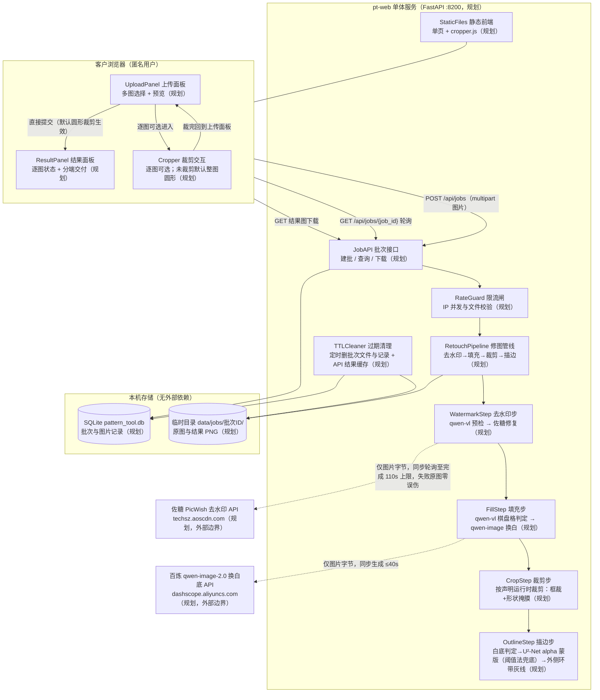
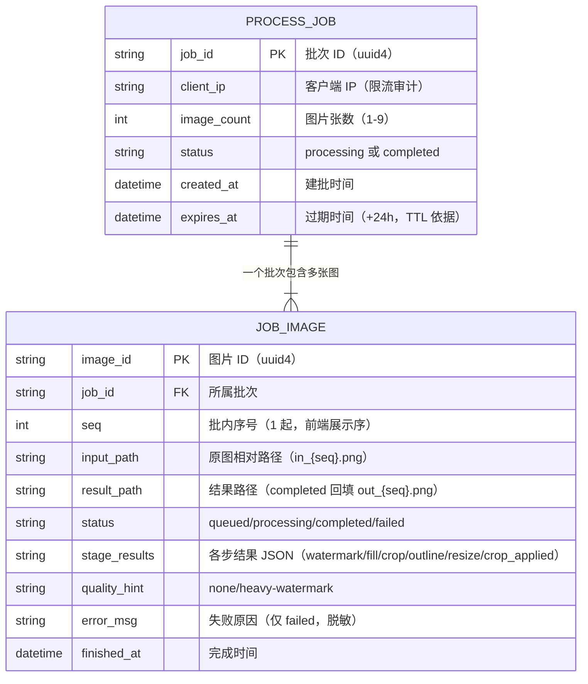
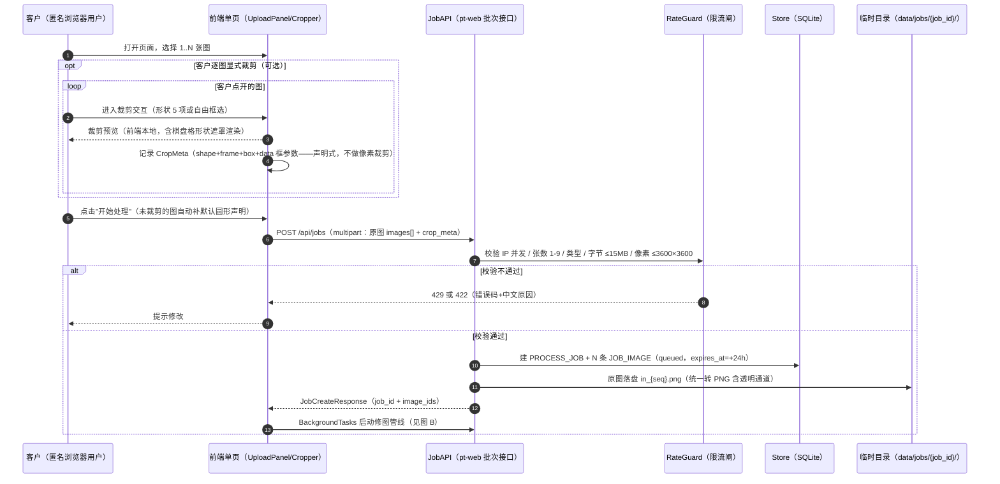
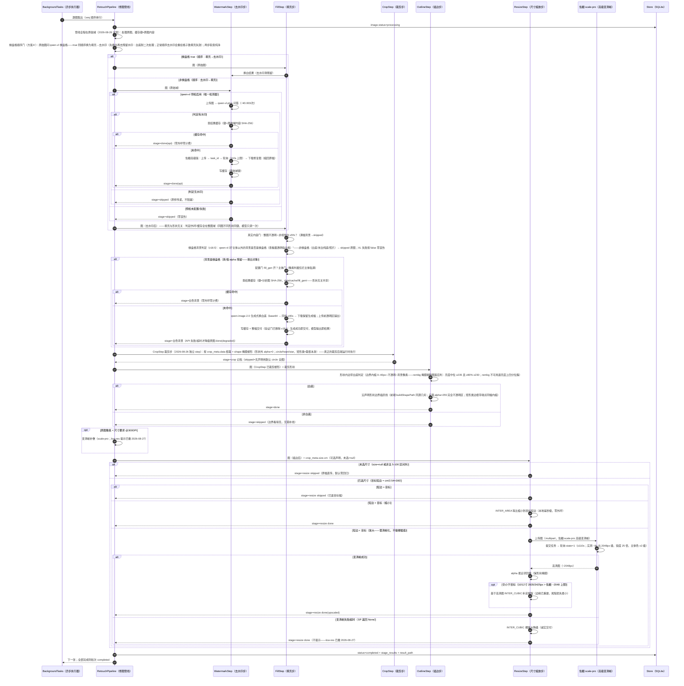
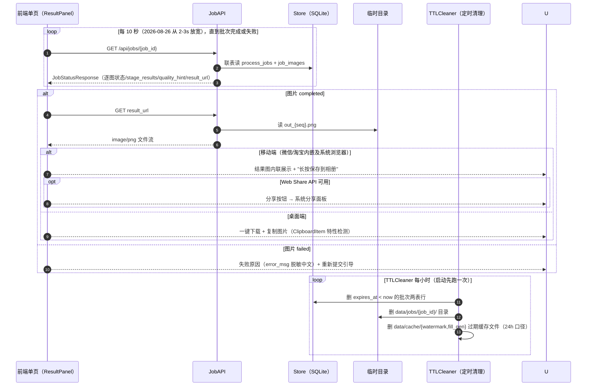

# C 端线上修图工具最小技术方案（pattern-tool）

- 文档类型：模块技术设计（最小可行工具）
- 生成日期：2026-08-24
- 口径真源：《需求文档深度解读报告.html》《技术架构方案.html》《图像处理技术方案.html》（2026-08-24 版）——业务口径与算法阈值来源，不涉及任何既有代码
- 状态标记：本项目为**全新独立项目**（不基于既有系统搭建），所有模块标注 `规划` / `砍掉`，无存量代码
- **修订记录**：
  - 2026-08-27（第七次修订）：**统一尺寸批量设置**（用户需求：同批多图打印尺寸相同时逐张下拉选太繁琐）：左栏上传区标题旁增"统一尺寸"下拉（档位与逐图一致 + 自定义 + 清除），选中即应用到当前全部待处理图并重渲列表（逐图下拉同步显示）；后端无改动（仍是逐图 crop_meta.size.cm 声明，批量只是前端一次性写入）。同日 UI 对齐三连修：①双栏等宽 1fr/1fr + stretch 等高；②免责声明去限宽与双栏左右对齐；③底部两按钮同规格同水平线（结果列表 flex 占满贴底）；上传列表保持九宫格（密度压缩方案实测后回撤）
  - 2026-08-27（第六次修订）：**双栏同屏桌面布局**（用户实测第五次修订后仍"像移动端界面被拉宽"——单栏线性滚动是移动信息架构，拉宽不改本质）：主区改 CSS Grid 双栏，左栏上传+已选列表（~40%）/右栏处理结果（~60%）**同屏共存**，上传→提交→看结果不再纵向滚动切换；右栏常驻（未提交时显示引导文案，替代原"结果面板隐藏→提交才显示"）；"开始处理"全宽拇指按钮 → 定宽右对齐（桌面规范）；副标题去"长按"（触屏词汇不出现在桌面版）；免责声明限宽 600px 并与 24h 删除提示合并为页脚；上传虚线框收窄（左右留白给已选缩略图）。处理步骤维持全自动不加配置面板（用户定案：流程最简学习成本最低）
  - 2026-08-27（第五次修订）：**桌面端交互优化**（用户定案：本工具只作桌面 Web 端用，不作移动端——7.1"移动优先"布局口径修订）：①容器 760→1100px、结果卡横向布局（缩略图左 2/3 + 信息右 1/3，1650px 屏不再半屏留白、缩略图可辨修图质量）；②hover 放大浮层上限 480→800px + 缩略图"悬停放大"角标（可发现性）；③裁剪弹层支持 ESC/点遮罩关闭（桌面肌肉记忆）；④Ctrl+V 粘贴图片直传（聊天窗口收图→粘贴→提交，高频路径省"先存盘"）；⑤提交后自动滚动定位结果面板；⑥"复制图片"反馈 2s 复原；⑦单张结果隐藏批量动作条（卡片内下载已覆盖）
  - 2026-08-27（第四次修订）：**建表 DDL 外置 `db/schema.sql`**（用户指令：DDL 不内嵌 store.py）——JobStore `_init_schema` 改为读取项目根 `db/schema.sql` 并 executescript；IF NOT EXISTS 幂等语义不变，缺文件/读失败按原逻辑抛出（fail-fast，不带缺表跑）
  - 2026-08-27（第三次修订）：**撤 low-res 提示**（用户实测超分效果达标——"清晰度放大处理效果不错，直接去掉"）：插值兜底路径不再置 quality_hint=low-res，hint 值域收窄为 none/heavy-watermark。降级插值仍保留（佐糖失败时交付不断），只是不再对用户做提示；**撤批量复制按钮**（剪贴板一次只能持 1 张图，逐张倒计时体验鸡肋——批量场景批量下载 ZIP 已够用；单张"复制图片"按钮保留，桌面端单图到剪贴板仍是高频路径）
  - 2026-08-27（第二次修订）：①**默认形状 circle → rectangle**（用户实测反馈"没选形状被裁成圆"非预期——2026-08-25"每图必有形状"定默认 circle 的口径修订）：未显式裁剪的图默认 = 矩形整图（不裁切、形状外不透明化、描边沿整图边框），显式选形状行为不变；②**resize 放大路径恢复佐糖 scale-pro 超分**（2026-08-26 终版退役的口径在"显式选大尺寸"场景让位——用户选 299px 源图打 12 寸，纯插值 19 倍糊到不可用；超分改主体的代价在此场景用户可接受，先实测效果再定去留）：超分成功仍不足目标再插值补尾程；佐糖失败/未配置降级 Lanczos 插值 + low-res 提示
  - 2026-08-27：`core/http.py` 事件循环模型修复——批次并行后多线程经 `http_sync` 外呼抛 `RuntimeError: bound to a different event loop`（共享 AsyncClient 的连接池连接绑在首个使用线程的循环上，跨线程循环复用即炸；串行单线程时代不触发）。定案：**全进程唯一后台事件循环线程**承接全部协程（`run_coroutine_threadsafe` 提交），anyio 原语只绑一个循环，连接池真正全局复用，lifespan 关闭从任意线程安全；对外 `get_http_client/http_sync/close_http_client` 面不变
  - 2026-08-26（当前·晚间修订）：去水印回退佐糖 PicWish 主力（qwen-image 换装当日多图实测效果不理想）；同日早些时候：填充 v18.6 终版（qwen-vl 棋盘格判定 → qwen-image 换白）、棋盘格顺序门（方案A'：棋盘格图管线顺序换为填充→去水印）、裁剪改后端运行时 CropStep、管线全程原始域、qwen-image 去水印换装（后被回退）；填充 v18.6 终版（qwen-vl 棋盘格判定 → qwen-image 换白，本地像素判据与验证门全线退役——"判定归模型语义问答、生成交付即结果"）；裁剪改后端运行时 CropStep（前端只声明）；管线全程原始域（同图不同形状共享缓存零重复外呼）；单图超时回调 120s
  - 2026-08-25：填充 v15 拓扑白名单定稿（后于 08-26 全线退役）；每图必有形状需求变更；去水印 qwen-vl 唯一检测器（OpenCV 检测退役）
  - 2026-08-24：初版（三步管线/批次模型/接口契约）

---

## 1. 背景与目标

### 1.1 痛点

当前修图链路全部由运营在桌面端完成：客户在旺旺/多多聊天窗口发图 → 运营手动 PS（去水印、裁剪、填充、描边）→ 回传客户。痛点：

- 每单 15+ 步人工操作，慢、易错、旺季积压（需求解读第 1 章）；
- 其中大量是**重复性标准动作**（去水印 → 填充 → 描边），机器可自动完成；
- 客户来回沟通修图要求（"帮我裁成圆形""边缘加条线"）占客服大量时间。

### 1.2 方案定位

把图案层修图核心能力（去水印 → 背景填充 → 纯白描边）做成**独立 C 端 Web 工具**，客户自助使用：

```
客户上传 1..N 张图（可选：每张自行裁剪）→ 提交 → 自动修图 → 获取成品（移动端长按存相册/分享，桌面端下载/复制）→ 发回聊天窗口
```

核心减负逻辑：**把"预裁剪感知"路径产品化**——客户在外部工具自己裁好形状已是主流路径（需求解读 5.1 / dd148.cn），本工具把"裁剪"做成前端交互（客户自己裁，看得见结果），后端砍掉自动裁剪（系统居中裁剪不准确、可能偏离客户意图），只做客户做不到的算法环节（去水印 / 填充 / 描边）。

**每张图必有裁剪形状（2026-08-25 需求变更；2026-08-27 默认值修订）**：客户可逐图显式裁剪（circle/square/rectangle/heart/star/free）；未显式裁剪的图默认 = **矩形整图**（2026-08-27 起，原 circle 整图内接圆撤销——用户实测"没选形状被裁成圆"非预期）：不裁切、形状外不透明化，描边沿整图边框——不存在"未裁剪"状态，描边/填充永远有形状边界可依。交互主路径 = 上传 → 提交 → 拿图（默认矩形整图直通，无需客户操作）。

**为什么客户裁剪在前、服务端去水印在后**（与内部系统"去水印→裁剪"顺序相反，但前提不同）：内部系统的裁剪是服务端自动裁——机器需要干净画面才能做轮廓识别；本工具裁剪由客户肉眼完成，人眼对水印位置天然可见，无需干净图辅助决策。且裁剪只会帮去水印的忙：角标水印常被直接裁掉（`watermark=skipped`，零修复痕迹最优）；跨裁剪边界的水印残留部分仍可局部检测修复。若反过来（先去水印再让客户裁），流程变两段式——服务端返中间图、用户裁完二次提交——任务模型复杂度陡增而质量无收益。

### 1.3 目标 / 非目标

**目标**

1. 客户零安装：浏览器打开即用，上传 → （可选裁剪）→ 提交 → 拿到处理好的 PNG 图案；
2. 分端交付零寻找成本：**电脑端**点"下载"自动落系统默认下载目录（浏览器默认行为，不弹位置选择），多张走批量下载 ZIP 解压后全选拖入聊天窗口（2026-08-27 撤批量复制——剪贴板单图上限）；**手机端**结果图内联展示 + 长按一步存入相册——网页静默写相册被 iOS/Android 权限模型禁止（仅原生 App 可为），长按保存即网页能力上限，按此验收；
3. 单次支持 1–9 张图批量提交，逐图独立处理、独立下载；
4. 自动修图三环节各有独立开关（检测到水印才修 / 有大面积空白才填 / 纯白背景才描边——图像处理方案第 1 章），跳过不产生副作用；
5. 处理结果附质量提示（quality_hint），让客户知道"这张建议线下找人工"；
6. 运营成本下降：标准修图动作不再经过运营。

**非目标（明确不做）**

| 砍掉项 | 原因 |
|---|---|
| 自动裁剪塑形 | 系统按中心点裁剪不准确，会偏离客户构图意图；裁剪改为前端交互由客户自己完成 |
| 订单 / 任务 / 复核 / 排版 / 条码 / 燃烧纸 / 打印 / ERP 回写 | 这是完整系统的环节（技术架构方案第 5 章 9 张表），本工具只取图案层三环节 |
| MinIO 文件中转、桌面端 Agent、多服务拆分 | C 端单体服务，图片小（几 MB），同进程临时目录即可，不需要对象存储解耦 |
| 人工复核工作台 | C 端无人兜底；复杂场景以 quality_hint 提示 + 尽力处理输出 |
| 用户账号体系 | 匿名 + IP 限流即可；不做注册登录 |
| 服务端超分（Real-ESRGAN） | MVP 不上 GPU；分辨率不足时提示客户换高清图（quality_hint），不做放大 |

**假设**

- 客户上传的图为常规手机截图 / 聊天图（PNG/JPG/WebP，≤ 15MB/张）；
- 去水印链路（2026-08-26 回退定稿，4.4）：qwen-vl 语义预检唯一检测器（~¥0.003/次）判有才修；修复佐糖 PicWish 高级版（当日曾换 qwen-image-2.0 生成式，多图实测整体效果不理想，用户定案回退）；修复失败 → 原图 + heavy-watermark 零误伤。OpenCV 检测已退役（2026-08-25）；
- 部署单实例（公网 VPS 或公司服务器），无 GPU 依赖；
- **业务量级（2026-08-24 确认）**：平时 300–400 单/天，高峰 700–800 单/天，按 1.5–2 图/单估图量。容量设计目标见 1.5 节。

### 1.5 容量测算与设计目标

按最坏情况（高峰订单全部走本工具）估算：

| 项 | 取值 | 推导 |
|---|---|---|
| 高峰图量 | 1200–1600 图/天 | 800 单 × 1.5–2 图/单 |
| 集中时段均值 | ~2.5 图/分钟 | 10–12 小时消化当日量 |
| 突发峰值 | 8–10 图/分钟（≈0.15 图/秒） | 晚间/大促 3–4× 均值 |
| 单图 CPU 耗时 | 5–15s（OpenCV 级；描边分割启用 rembg 时 +1–3s） | 峰值同时活跃 ~1–2 核 |
| 磁盘瞬时驻留 | 12–24GB | 5MB×2（进+出）×1600 图，TTL 24h 内驻留 |
| 轮询负载 | 数百并发只读 GET | FastAPI 联表读，可忽略 |
| 入向带宽（上传） | 峰值 ≈4Mbps，突发 ≈16Mbps | 0.15 图/秒 × 3MB（预压后均值）；入向流量免费且 ≥100Mbps，非瓶颈 |
| 出向带宽（结果下载） | 3–6GB/日 | 1600 图 × 2–4MB PNG；按量计费约几十元/月，可接受 |

**结论**：4 核 CPU + 50GB 磁盘 + 8GB 内存的单实例即可承载高峰；单体架构（无队列中间件、无多实例）在此量级成立。两个前提：全局并发上限（6.2 节）防 CPU 打满、磁盘水位监控（6.3 节）防 TTL 清理前撑爆。

真实负载会低于此口径：采用率 < 100%（部分客户仍直接发聊天窗口），实际压力是本表的若干折——容量按全量压测口径设计，留有余量。

### 1.4 对齐基线表

| 边界 | 唯一真源 | 版本 | 对齐方式 |
|---|---|---|---|
| 修图环节口径与阈值 | 《图像处理技术方案.html》 | 2026-08-24 | 分级条件、跳过条件、描边参数（1–2mm 灰线 RGB(190,190,190)）照搬 |
| 三类订单 / 预裁剪感知口径 | 《需求文档深度解读报告.html》 | 2026-08-22/24 | 本工具对应"纯定制类·预裁剪感知"路径的产品化 |
| 裁剪形状选项 | 《需求文档深度解读报告.html》5.1 | 2026-08-22/24 | 常规形状 5 项（圆/正方/长方/爱心/星形）+ 自由矩形 |
| 混合架构与异步处理原则 | 《技术架构方案.html》第 4 章 | 2026-08-24 | 借鉴"上传与处理解耦、状态中枢是处理记录"原则；本工具为单体，简化为进程内异步 |

---

## 2. 总体架构



### 2.1 分层说明

| 架构模块 | 职责 | 对应类或模块 | 状态 |
|---|---|---|---|
| 前端单页 | 上传、提交（未裁剪图自动补默认圆形 crop_meta）、逐图可选显式裁剪、轮询展示、分端交付 | `pattern-tool/web/index.html` + `cropper.js` | 规划 |
| 批次接口 | 建批（收 multipart）、状态查询、结果下载 | `pattern-tool/src/api.py` | 规划 |
| 限流闸 | IP 并发批次上限、文件类型/大小校验、去水印免责声明随页返回 | `pattern-tool/src/guard.py` | 规划 |
| 修图管线 | 逐图串行执行五步（去水印→填充→裁剪→描边→尺寸缩放，裁剪/缩放先后独立成 step），各步独立跳过，产出 quality_hint。**全程原始域（2026-08-26 定案）**：管线处理原图，缓存键=原图内容——同图不同形状共享全部缓存与外呼。**棋盘格顺序门（2026-08-26 方案A'）**：原始图先问 qwen-vl 棋盘格——true 时管线顺序换为**填充→去水印**（先换白再去残留水印：白底不怕二次生成，而正常顺序去水印会重绘格子致填充失效）；两步职责纯净无双任务提示词，双键照常记档。**步骤开关**（2026-08-25 增，调试用）：`PT_STEPS_ENABLED`（逗号分隔，默认 `watermark,fill,outline`）——只执行列出的步骤，未列步骤按 `skipped` 记档不执行（如单测去水印链路设 `watermark`），生产行为与默认无差 | `pattern-tool/src/pipeline.py` | 规划 |
| 去水印步 | **qwen-vl 检测 + 佐糖 PicWish 修复（2026-08-26 回退恢复主力——当日曾换 qwen-image 生成式，多图实测整体效果不理想）**：每图 qwen-vl-plus 语义预检（~¥0.003/次）判有才修；修复佐糖高级版全屏自动去水印（提交-轮询-下载，同步 ≤110s）；佐糖失败 → 原图 + heavy-watermark 零误伤；预检未配/失败 → skipped 原图；结果缓存（原始域键）同图免计费 | `pattern-tool/src/steps/watermark.py` + `watermark_picwish.py` | 规划 |
| 填充步 | **v18.6 终版（2026-08-26 用户定案——本地像素判据全线退役：白度/色簇/熵/验证门多轮实测效果差）**：①**棋盘格背景判定**（qwen-vl 问答"主体以外的背景是否是棋盘格（查看器透明指示格）"，~¥0.003/次；真 alpha 预览拍平截图/素材站假 alpha 导出都带棋盘格；标定 4/4；VL 失败按 false 零误伤）→ 非棋盘格 skipped 原图（白底/米白/照片都不填）；②棋盘格 → qwen-image-2.0 生成式换白底（配置门 `PT_FILL_GEN_*` + 主体门像素判据仅拦"主体贴满"；同步 ≤40s base64 上传透明区铺白）；结果缓存 `data/cache/fill_gen/`（SHA-256 键形状无关同图共享）；**生成成功即交付（验证门已移除 v18.6；**v18.6.1 色阶归一已撤 15:20**——用户实测背景区拉伸在主体交界产生颜色断层，纸白问题回归提示词约束：qwenbg._PROMPT 强化版数值锚定"每处像素达 255 禁止 249/250 纸白"+ negative 夹击"纸白色背景/249灰/主体颜色断层"，实测纯白 1.1%→62%、角点 255、主体保真 ±3）**，模型原样整幅输出（保留生成幅零后处理）；API 失败/超时 → 原图 skipped（已尝试记 done(degraded)） | `pattern-tool/src/steps/filling.py` + `fill_qwenbg.py` + `fill_gen_cache.py` + `fill_gate_vl.py` | 规划 |
| 裁剪步 | **CropStep（2026-08-26 独立 step，形状几何复用 outline.crop_shape_region_mask）**：真正的裁剪在后端运行时执行——按 crop_meta.data（前端框 x/y/w/h 相对原图像素，frame=原图尺寸做等比映射）裁出外接框区域，再按 shape 掩膜塑形（形状外 alpha=0；circle/heart/star，矩形类=裁框本身）。前端只声明形状与框（不做像素裁剪），同图切换形状 = 同一原图 + 不同声明，模型外呼零重复 | `pattern-tool/src/steps/crop.py` | 规划 |
| 描边步 | **描边对象 = 最终形状边界，白底才画线**（图像处理方案 3.5 口径）：形状内边带（边界内缩 0–40px∩不透明∩**背景像素**——rembg 掩膜剔除图案后判亮度：中位 ≥235 且 ≥90% ≥230；rembg 不可用退亮度上四分位簇兜底）→ 白底才沿声明形状边界描灰线（前端 buildShapePath 同源几何；线带内缩一个线宽、只落 alpha=255 完全不透明区——抗锯齿半透明带会混色断线；矩形类边框带端点同幅内缩防四角凸块）。**每图必有形状**：无显式声明默认 rectangle 整图边框（2026-08-27 修订，原 circle 撤销） | `pattern-tool/src/steps/outline.py` | 规划 |
| 尺寸缩放步 | **ResizeStep（2026-08-26 新增；2026-08-27 放大路径恢复超分并撤 low-res 提示）**：用户逐图可选打印尺寸（4/6/8/10/12寸 cm 口径 + 自定义 5–100cm，默认不选=原幅）；目标短边 = cm/2.54×300@DPI。缩小 INTER_AREA；**放大优先佐糖 scale-pro 高级变清晰**（协议同去水印三动作，key 复用 `PT_WM_API_KEY`，同步 ≤110s；2026-08-26 曾退役——超分改主体与"主体不可变"红线冲突；2026-08-27 在"显式选大尺寸"场景恢复：小源图大倍率纯插值不可用是更硬的痛点，实测效果达标）——超分结果仍小于目标再插值补尾程；佐糖失败/未配置降级 Lanczos 插值（不再提示 low-res——2026-08-27 第三次修订撤提示，hint 值域收窄 none/heavy-watermark）。置于管线最末（描边后）：线宽像素随缩放等比、打印物理毫米恒定 | `pattern-tool/src/steps/resize.py` + `picwish_scale.py` | 规划 |
| TTL 清理 | 定时删除过期批次文件与记录（默认 24h）+ API 结果缓存文件（watermark/ + fill_gen/，同 24h 口径） | `pattern-tool/src/ttl.py` | 规划 |
| SQLite | 批次/图片记录，审计与限流依据 | `pattern-tool/src/store.py` | 规划 |

**明确砍掉**：服务端自动裁剪（前端声明式 + 后端 CropStep 运行时执行）；MinIO / boto3 / 消息队列 / 多服务拆分均不引入。

### 2.2 数据归属

| 数据 | 去处 | 说明 |
|---|---|---|
| 批次记录 / 图片记录 | SQLite `pattern_tool.db` | 仅元数据与状态（两表，见第 3 章），业务持久化。**建表 DDL 外置 `db/schema.sql`**（2026-08-27 第四次修订：DDL 不再内嵌 store.py——schema 是独立交付物，改表先改 .sql 再动代码；JobStore 初始化时读取并 executescript，幂等 IF NOT EXISTS 语义不变） |
| 客户原图 / 处理结果 PNG | 本机临时目录 `data/jobs/{job_id}/` | 非业务持久化，TTL 24h 自动清理 |
| 图片字节 | 不进数据库 | 数据库只存文件相对路径 |
| 处理中间态 | 进程内存 + `stage_results` JSON 字段 | 各步跳过/执行/提示的结构化留痕 |
| API 结果缓存 | `data/cache/{watermark|fill_gen}/{hash前2位}/{hash}.png` | 同图免重复外呼，TTL 24h 清理 |

---

## 3. ER 图



### 3.1 实体与存储位置

| 实体 | 存储位置 | 说明 |
|---|---|---|
| PROCESS_JOB / JOB_IMAGE | SQLite（WAL 模式） | 单文件库，随 TTL 清理行 |

### 3.2 不进入 ER 图的协议 DTO

multipart 请求体、JobCreateResponse、JobStatusResponse、MetaResponse、CropMeta（`{shape, frame, box, data:{x,y,width,height}}` 声明式裁剪）——均为瞬时接口对象不落库。

### 3.3 数据库字段中英对照

见 ER 图属性注释（字段名=英文，注释=中文语义）。`stage_results` 值域：watermark→`done(api)/skipped`；fill→`done/白色背景/done(degraded)/skipped`；crop→`done`（或原始声明 JSON）；outline→`done/skipped`；resize→`done/done(upscaled)/skipped`（2026-08-26 尺寸缩放步新增）；crop_applied→`done`（执行态补充键，仅 CropStep 实际塑形时记档，前端用于区分"裁剪:形状名"与"裁剪:形状名(默认)"）。

**接口下发白名单（4.2 ImageStatusDTO.stage_results）**：watermark/fill/outline/crop/resize/crop_applied（resize 与 crop_applied 随 2026-08-26 分辨率格改版进白名单——漏发会导致前端"分辨率"格恒显"跳过"、裁剪格恒带"(默认)"）。

---

## 4. 接口与契约对齐

### 4.1 接口清单（匿名 HTTP）

| 接口 | 方法 | 说明 |
|---|---|---|
| `/api/jobs` | POST | multipart（images[] 1-9 张 + crop_meta 声明 JSON）→ JobCreateResponse |
| `/api/jobs/{job_id}` | GET | 轮询批次状态（前端 10s 间隔）→ JobStatusResponse |
| `/api/jobs/{job_id}/images/{image_id}/result` | GET | 结果 PNG（completed 才 200；未完成 409；不存在/过期 404） |
| `/api/meta` | GET | 免责声明 + 形状选项 + 大小限制 |

错误码：429（IP 并发限流）/ 422（张数/类型/大小/像素不合规，中文原因）/ 404 / 409 / 410 / 500。

### 4.2 接口 DTO 字段表

| DTO | 字段 | 说明 |
|---|---|---|
| JobCreateResponse | job_id, image_ids[] | 轮询与下载凭据，顺序=上传序 |
| ImageStatusDTO | image_id, seq, status, stage_results, quality_hint, result_url?, error_msg? | 轮询单图状态 |
| MetaResponse | disclaimer, remote_api_disclaimer, crop_shapes[], max_images, max_image_mb, max_image_pixels, min_image_pixels, reject_duplicate_images | 页脚渲染 + 前端预校验 |

### 4.3 契约对齐矩阵

| 决策点 | 取值 | 依据 |
|---|---|---|
| 裁剪执行方 | 前端声明、后端 CropStep 运行时执行 | 同图不同形状共享缓存与外呼（2026-08-26 定案） |
| 处理顺序 | 去水印→填充→裁剪→描边；棋盘格图换为填充→去水印（顺序门） | 格子保护 + 白底耐二次处理 |
| 结果保留 | 24h TTL | 隐私 + 磁盘水位 |
| 实现与 `src/app/api.py` 一致 | — | 代码为真源，本表为契约摘要 |

### 4.4 外部模型 API 边界（去水印修复档 + 填充生成式，配置开关）

**供应商定标（2026-08-26 回退定稿：佐糖 PicWish 高级版主力恢复）**：当日曾换装 qwen-image-2.0 生成式（单图对比改动面 5.6% vs 44.5% 占优），但多图实测整体效果不理想，用户定案回退佐糖高级版（10 算粒/次，全屏生成式重建；2026-08-25 首轮实测：满图斜排浅字带清除、主体完整）。qwen-image 去水印客户端已移除。**退役清单**（探索结论存档）：Gemini 中转站×2（网关裁剪图像输出）、wanx2.1（贵且依赖不可靠 mask）、qwen-image 去水印（2026-08-26 换装当日回退——效果不理想）、IOPaint LaMa（mask 不可靠在检测）、残差检测源（mask 必盖主体）。

**修复策略（2026-08-26 回退版）**：

| 环节 | 触发条件 | 动作 | 成本 |
|---|---|---|---|
| 检测·qwen-vl 预检 | 每图（唯一检测器，OpenCV 源 2026-08-25 退役） | qwen-vl-plus 视觉问答"有无水印"（~¥0.003/次）；判有才修；判无/失败 → 原样（不盲修零误伤） | ¥0.003/图 |
| 修复·佐糖 | 预检判有且缓存未命中 | 佐糖 PicWish 高级版全屏自动去水印（提交-轮询-下载，同步 ≤110s） | 10 算粒（~¥0.2） |
| 棋盘格顺序门（方案A'） | 原始图判定棋盘格 true（qwen-vl） | 管线顺序换为填充→去水印：先换白（格子→纯白，白底不怕二次处理）再去残留水印；两步职责纯净 | VL ¥0.003 + 换白生成费 + 佐糖费（有水印时） |
| 兜底 | 修复失败/超时/未配 | 原图 + heavy-watermark 提示（零误伤） | ¥0 |
| 放大·变清晰 | 用户选尺寸且源短边 < 目标（cm/2.54×300） | **佐糖 scale-pro 高级变清晰**（协议同去水印：multipart image_file + X-API-KEY → 轮询 state=1 → 下载；输入 ≤4096px/30MB；实测 350px→2048px 锐度 2→51、主体色 ±2 级、~8s）；结果仍小于目标（10/12寸 2835/3425px > 2048 上限）再 INTER_CUBIC 补尾程；失败降级裸插值不提示（low-res 已撤 2026-08-27） | 按佐糖计费（算 resize 侧） |

| 要素 | API 侧对象 | 本工具侧映射 | 约束与校验 |
|---|---|---|---|
| 调用模式 | **检测 qwen-vl-plus**：同步问答（oss:// 临时 URL）。**修复佐糖 PicWish 高级版**：异步 `POST /api/tasks/visual/advanced/watermark-remove`（multipart 字段 `image_file`，Header `X-API-KEY`）→ 轮询 `{task_id}` 至 `state=1`（2s 间隔，110s 上限）→ `data.image_url`（OSS 签名 URL 1h）下载，缩回原幅 | WatermarkStep 内嵌调用（`watermark_picwish.py`） | `PT_WM_API_ENABLED` / `PT_WM_API_KEY` / `PT_WM_API_TIMEOUT_SECONDS=110`；预检 `PT_WM_PRECHECK_*` |
| 填充生成式 | **qwen-image-2.0**（填充步）：同步 multimodal-generation（base64 上传，`prompt_extend=false`/`watermark=false`，同步 ≤40s） | FillStep（`fill_qwenbg.py`） | `PT_FILL_GEN_*` 五配置；生成成功即交付（验证门已移除 v18.6） |
| 请求载荷 | 仅图片字节（multipart/base64） | 不透传 job_id/IP/任何业务元数据 | 隐私红线 |
| 响应载荷 | 修复/生成图 URL | 下载后走 out 落盘；**写缓存**（SHA-256 键） | 失败不计费不写缓存 |
| 密钥 | 佐糖 X-API-KEY / DashScope Key | `.env`（pydantic-settings） | 绝不进前端/日志/错误信息 |

---

## 5. 时序图

### 5.1 图 A：上传与建批



**图 A 说明**：裁剪纯声明（2026-08-26 定案）——前端只记形状+框参数，像素裁剪由后端 CropStep 运行时执行；同图不同形状共享管线缓存与模型外呼。

### 5.2 图 B：逐图修图管线（五步各自独立跳过：去水印→填充→裁剪→描边→尺寸缩放）



**图 B 说明**：管线五步串行、独立跳过（尺寸缩放为末步，置描边后——线宽像素随缩放等比、打印物理毫米恒定）；棋盘格顺序门只换顺序不改步骤职责；填充判定/外呼/缓存与形状无关（形状语义归 CropStep/描边）；去水印/换白均"仅图片字节出境"，失败原图零误伤。

### 5.3 图 C：轮询取图与过期清理



---

## 6. 异常与非功能

| 类别 | 项 | 规则 |
|---|---|---|
| 输入校验 | 张数/类型/大小/像素 | 1–9 张；PNG/JPG/WebP；≤15MB/张；解码后 ≤3600×3600px（header 探测防调色板 PNG 内存攻击）≥200px；同批 SHA-256 查重；超限 422 中文原因 |
| 超时口径 | 单图处理时长 | 180s 上限（佐糖回退恢复 110s + 换白生成式 40s + 描边 ~10s 最坏和）**只计 processing 不计排队**；排队超 10 分钟置 failed 提示错峰 |
| 限流 | IP 并发批次 | 同 IP 进行中批次 >3 → 429 |
| 并发 | 全局 processing | 服务级信号量 ≤ 2×CPU 核（0=自动）；uvicorn worker=1（SQLite 单写者） |
| 隐私 | 客户图片 | 匿名、24h TTL、下载凭 job_id（uuid4 不可枚举）。**第三方传输**：启用外部 API 档时仅图片字节出境（业务元数据不出境），免责声明明示 |
| 磁盘 | 水位 | 12–24GB 瞬时驻留估算；TTL 每小时清理；监控水位 <70% |
| 观测 | 降级统计与升级判据 | 每日聚合 stage_results × quality_hint。升级触发：① heavy-watermark >15%（修复效果/启用评估）；② fill=done(degraded) >20%（换白失败率高评估）；③ failed >10%；④ API 月成本 >¥800；⑤ API 降级率 >30%（供应商不稳评估备选） |
| 批内隔离 | 单图失败 | 单图 failed 不影响批内其他图（逐图独立 try/except + 状态机） |

---

## 7. 实施与验收

### 7.1 技术选型与依赖清单

| 用途 | 选型与钉定版本 | 约束 |
|---|---|---|
| 语言运行时 | Python 3.11 / 3.12 | 全量类型标注；不用 3.13+ |
| Web 框架 | `fastapi==0.141.1` | + `python-multipart==0.0.20` |
| 服务器 | `uvicorn[standard]==0.52.4` | worker=1 |
| 配置 | `pydantic==2.13.4` + `pydantic-settings==2.15.0` | `PT_` 前缀 env；密钥绝不入库/前端/日志 |
| 图像核心 | `numpy==2.5.2` + `opencv-python-headless==4.14.0.94` | headless；钉 4.x |
| 编解码 | `pillow==12.3.0` | header 探测 + 统一 PNG 落盘 |
| 描边分割 | `rembg==2.0.81`（u2netp 4.5MB） | 自带 onnxruntime（rapidocr 退役后唯一 DL 依赖）；离线部署预下载 |
| HTTP | `httpx==0.28.1` | 全部外部 API 裸调（无 vendor SDK） |
| 测试 | `pytest==9.1.1` | ASGI Transport；算法步造样图+像素断言 |

**负面清单**：任务队列/Redis、MinIO/boto3、SQLAlchemy、dashscope/openai SDK、PaddleOCR、Real-ESRGAN/LaMa、前端构建链与框架（原生单页）、Caddy、多服务编排。

### 7.2 代码模块映射

| 顺序 | 模块 | 内容 |
|---|---|---|
| 1 | `src/jobs/store.py` | SQLite 两表读写 + WAL |
| 2 | `src/app/api.py` | 四接口 + 限流闸 + 免责声明 |
| 3 | `src/steps/watermark/`（watermark + picwish + precheck + cache） | 去水印（VL 检测 + 佐糖修复 + 缓存） |
| 4 | `src/steps/fill/`（filling + gate_vl + qwenbg + cache） | 填充（VL 棋盘格判定 + qwen-image 换白 + 缓存） |
| 5 | `src/steps/crop/` | CropStep（声明式运行时裁剪） |
| 6 | `src/steps/outline/` | 描边（白底判定 + rembg 蒙版 + 环带灰线；形状几何同源） |
| 6b | `src/steps/resize/`（resize + picwish_scale）+ `src/steps/imaging/`（编解码公共） | 尺寸缩放（佐糖变清晰放大）+ 三步共用编解码 |
| 7 | `src/jobs/pipeline.py` | 五步编排 + 顺序门 + 超时 + 状态回写 |
| 8 | `src/jobs/ttl.py` | 过期清理（批次 + 双缓存目录） |
| 9 | `web/` | 原生单页 + cropper.js@1.6.2（vendor 内嵌） |

### 7.3 验收清单（全部可由测试/接口/数据库检查证明）

| # | 验收项 | 证明方式 |
|---|---|---|
| 1 | 建批响应 job_id + image_ids 顺序一致 | 接口断言 |
| 2 | 状态机单调（queued→processing→completed/failed） | 轮询采样断言 |
| 3 | 三算法步独立跳过（无水印 skipped / 非棋盘格 skipped / 非白底描边 skipped） | stage_results 断言 |
| 4 | 描边沿形状边界（非外接矩形）、线宽 1.5mm±0.5、图案本体零侵占、白灰尘点不产杂圈、线带连续 | 像素断言 |
| 5 | 填充：棋盘格图 → fill=白色背景（生成成功即交付）；白底/米白纯底/照片 → VL false skipped 零图像生成外呼；VL 失败按 false 不填 | stub 调用计数 + 像素断言 + E2E |
| 5a | 同图二次提交命中缓存零外呼；不同形状同图共享缓存 | mock 计数 |
| 6 | 去水印：水印图 → done(api)（佐糖）；无水印图 → 判无 skipped 零修复外呼；修复失败 → 原图+heavy-watermark 零误伤；缓存命中零外呼 | 集成 + mock 计数 |
| 6a | 棋盘格顺序门：棋盘格图管线顺序=填充→去水印（stage 双键都有值），非棋盘格=常规顺序 | 日志/断言 |
| 7 | 放大变清晰（scale-pro 超分 + 尾程插值；low-res 提示已撤） | 接口断言 |
| 8 | 批内隔离（坏图 failed 不影响他图） | 混合批次 |
| 9 | 校验与限流（10张/20MB/非图片 422；同 IP 第 4 批 429） | 接口逐一断言 |
| 10 | 交付四态（completed 200 PNG / 未完 409 / 不存在 404 / 过期 404） | 接口断言 |
| 11 | 免责声明 `/api/meta` 返回 + 页脚渲染 | 接口 + 页面 |
| 12 | 脱敏（error_msg 无路径/堆栈） | 失败触发断言 |
| 13 | 重启恢复（悬挂 processing/queued 置 failed 中文话术；completed 仍可下载） | 集成 |
| 14 | TTL（expires_at 过去后清理行+文件+缓存，访问 404） | 集成 |
| 15 | E2E：真实图提交 → 轮询 → 下载 PNG（默认圆形生效） | 手工/自动验收 |
| 16 | 选型合规（pip freeze 对照 + 负面清单扫描 + .env 不入库 + 键与 Settings 一一对应） | 清单比对 + rg 扫描 |
